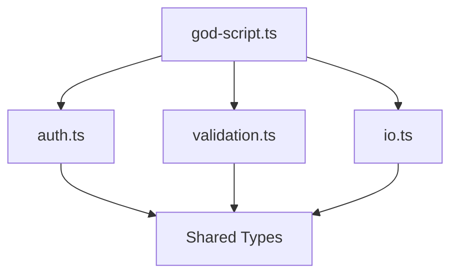

# Refactor Code

You are tasked with refactoring monolithic "God-like" scripts/modules into clean, focused, testable units. This command operates in two modes depending on the target.

## Usage Modes

- `/refactor src/utils/helpers.ts` - **File Mode**: Refactor a specific file
- `/refactor src/services/` - **Directory Mode**: Find candidates, then refactor one
- `/refactor` - **Interactive Mode**: Scan for candidates automatically

The target path is available as `$ARGUMENTS`.

## Interaction Protocol

**CRITICAL**: When executing the refactoring plan:
1. Complete one phase (e.g., Add Tests)
2. Run verification
3. **STOP and present results**
4. **Do NOT proceed to the next phase until the user types "continue", "next", or "proceed"**
5. If verification fails, report the scoped diff of workflow-touched files
   and wait for the user's decision (see Failure Handling)

## Initial Response

### When invoked WITHOUT arguments (Interactive Mode):
```
I'll help you find and refactor God-like modules in your codebase.

Scanning for refactoring candidates...
```
Then spawn `god-module-finder` agent to scan the codebase and present top 5-10 candidates ranked by severity.

### When invoked WITH a directory path (Directory Mode):
Announce the scan, then spawn `god-module-finder` scoped to that directory —
the agent owns the weighted God-score definition and severity tiers
(`agents/god-module-finder.md`, single source; do not restate weights here). Present top 5-10 candidates ranked by score (not hard thresholds) and ask user to pick ONE.

### When invoked WITH a file path (File Mode):
```
Starting refactor analysis for: [file]

First, detecting project type and conventions...
```
Then proceed to Step 1 immediately.

## Global Ignore Patterns

Always exclude from discovery and analysis:
- `node_modules/`, `.git/`, `dist/`, `build/`, `target/`
- `vendor/`, `.venv/`, `__pycache__/`, `coverage/`
- `*.min.js`, `*.bundle.js`, `generated/`, `*.generated.*`

## Step 0: Language Detection (All Modes)

Before any analysis, detect the project environment:

1. **Check for project markers** (use nearest manifest to target file):
   - `package.json` → Node.js/TypeScript (use `npm test`, `import` patterns)
   - `requirements.txt` / `pyproject.toml` / `setup.py` → Python (use `pytest`, `from/import` patterns)
   - `go.mod` → Go (use `go test ./...`, `import` patterns)
   - `Cargo.toml` → Rust (use `cargo test`, `cargo clippy`, `cargo fmt`)
   - `Makefile` → Check for `make test` target

2. **Handle monorepos**: If multiple manifests exist, use the one closest to the target file. If directory mode spans multiple packages, group candidates by package root.

3. **Determine test command**:
   ```
   Project Type: [detected]
   Test Command: [npm test | pytest | go test ./... | cargo test | etc.]
   Lint Command: [npm run lint | flake8 | golangci-lint | cargo clippy | etc.]
   Format Command: [prettier | black | gofmt | cargo fmt | etc.]
   Import Pattern: [import/from | import | use]
   ```

4. **Store for later use** in verification steps

## Step 1: Read and Understand Current State (File Mode)

1. **Read the target file completely** - if the tool returns partial content, continue reading subsequent ranges until EOF. God files are big by definition.
2. **Read related files** - imports, tests, direct consumers
3. **Map current responsibilities** - what does this code do?
4. **Identify global state** - variables like `driver`, `config`, `logger`, `db`
5. **Detect file type**: Is this a library module (exports API) or a script (CLI args, env vars, file I/O)?

## Step 2: Capture API Snapshot (Baseline)

**CRITICAL**: Before any analysis that might lead to changes, capture the baseline and persist it.

Spawn `api-snapshotter` agent:
```yaml
Task - API Baseline:
  subagent_type: api-snapshotter
  Prompt: |
    Capture complete API surface for [file].

    For LIBRARY MODULES:
    - All exports (functions, classes, types, constants)
    - Type signatures if TypeScript
    - Docstrings/comments for public API

    For SCRIPTS (shebang, __main__, cmd/ entrypoints):
    - CLI arguments and flags
    - Environment variables read
    - Files read/written
    - Exit codes and stdout/stderr contracts

    Return: structured snapshot for later comparison
    Limit response to 100 lines.
```

**Persist the snapshot** to:
`thoughts/shared/plans/YYYY-MM-DD-api-snapshot-[component].md`

This enables deterministic before/after comparison by `refactor-validator`.

## Step 3: Spawn Analysis Agents (Parallel)

Use Task tool to spawn all analyzers in a single message (parallel execution):

```yaml
Task 1 - Responsibility Analysis:
  subagent_type: responsibility-decomposer
  Prompt: |
    Analyze [file] for distinct responsibilities.
    Project type: [detected type from Step 0]

    Identify: separate concerns, implicit domains, mixed abstractions.
    Check: relative file paths that would break if code moves.
    Generate: Mermaid diagram showing proposed module split.

    Return: proposed module breakdown with responsibility assignments.
    Include line ranges for each identified responsibility.
    STRICT LIMIT: 150 lines maximum.

Task 2 - Coupling Analysis:
  subagent_type: coupling-analyzer
  Prompt: |
    Analyze coupling patterns in [file] and its relationships.
    Project type: [detected type from Step 0]

    Find: tight coupling, circular dependencies, inappropriate intimacy.
    Detect: global state usage (driver, config, logger, db connections).
    Suggest: dependency injection points for extracted modules.

    Return: coupling metrics and decoupling opportunities.
    STRICT LIMIT: 100 lines maximum.

Task 3 - Consumer Impact:
  subagent_type: consumer-mapper
  Prompt: |
    Find all consumers of [file].
    Project type: [detected type from Step 0]

    Trace: re-exports recursively (index.ts → utils.ts → actual consumer).
    Include: CLI invocations (`python [file]`, `node [file]`).
    Include: file I/O dependencies (does another file read output of this one?).

    Map: which exports are used where, API surface analysis.
    Return: consumer list with specific usage patterns.
    STRICT LIMIT: 120 lines maximum.

Task 4 - Test Coverage Check:
  subagent_type: test-runner
  Prompt: |
    Find all tests for [file].
    Project type: [detected type from Step 0]

    Analyze: coverage gaps, missing edge cases, test quality.
    Assess: can we write unit tests, or do we need characterization tests?

    Return: test coverage assessment and testing strategy recommendation.
    STRICT LIMIT: 100 lines maximum.
```

**Wait for ALL agents to complete before proceeding.**

## Step 4: Synthesize Findings

After all agents complete:
- Consolidate into unified understanding
- Identify refactoring strategy
- Calculate risk assessment
- Determine if unit tests are feasible or if characterization tests are needed
- Note any global state that needs injection

## Step 5: Present Decomposition Options

Present findings with visualization:

```
Based on my analysis of [file]:

## Current State
- Lines of Code: X
- Exports: Y
- Consumers: Z files
- Test Coverage: W%

## Issues Identified
- [Responsibility 1] mixed with [Responsibility 2]
- Tight coupling to [module]
- Global state: [driver, config, etc.]
- Relative paths that would break: [list]

## Proposed Decomposition

### Text View (for plain terminals)
```
god-script.ts (current)
  ├── auth.ts (extracted) → login, logout, verify
  ├── validation.ts (extracted) → validateEmail, validateUser
  ├── io.ts (extracted) → readFile, writeOutput
  └── types.ts (shared) → User, Config, Token
```

### Diagram View (if Mermaid supported)


### Option A: Extract by Domain
| New Module | Responsibility | Functions | Est. LOC |
|------------|----------------|-----------|----------|
| auth.ts | Authentication | login, logout, verify | ~80 |
| validation.ts | Input validation | validateEmail, validateUser | ~60 |

### Option B: Extract by Layer
| New Module | Responsibility | Functions | Est. LOC |
|------------|----------------|-----------|----------|
| service.ts | Business logic | processUser, handleAuth | ~100 |
| repository.ts | Data access | fetchUser, saveUser | ~40 |

## Risk Assessment
- **High**: [specific risk]
- **Medium**: [specific risk]
- **Low**: [specific risk]

## Testing Strategy
- [ ] Unit tests feasible: [Yes/No]
- [ ] Characterization tests needed: [Yes/No]
- [ ] Golden master approach: [If needed, describe]

Which approach would you prefer? (Or suggest modifications)
```

**STOP and wait for user selection.**

## Step 6: Write Refactoring Plan

After user chooses approach, write detailed plan to:
`thoughts/shared/plans/YYYY-MM-DD-refactor-[component-name].md`

### Plan Template

```markdown
# Refactor: [Component Name]

## Overview
[What we're refactoring and why]

## Current State
- File: [path]
- Lines: [count]
- Responsibilities: [list]
- Consumers: [count] files import this
- Global State: [driver, config, logger, etc.]

## API Snapshot (Must Preserve)
```
[Export list from api-snapshotter]
```

## Target State

```mermaid
[Diagram from responsibility-decomposer]
```

## Refactoring Strategy: Facade Pattern

**CRITICAL**: To minimize consumer churn:
1. Extract logic to new focused modules
2. Keep original file as a **facade** that re-exports everything
3. Verify all tests pass with facade in place
4. (Optional, later) Migrate consumers to import directly from new modules

## What We're NOT Doing
- Changing public API signatures
- Breaking existing import paths (facade preserves them)
- Adding new features
- Fixing unrelated bugs

---

## Phase 1: Establish Test Baseline

### Overview
Before any refactoring, establish behavior verification.

### Strategy Selection:
- [ ] **Unit Tests** - If testable in isolation
- [ ] **Characterization Tests** - If unit tests impossible
  - Run with known inputs
  - Capture outputs (logs, files, state)
  - Save as "Golden Master"
  - Compare after refactoring

### Changes Required:
- Create [test file] with comprehensive coverage
- Cover each exported function
- Document current behavior (even if buggy - preserve it)

### Success Criteria:

#### Automated Verification:
- [ ] All new tests pass: `[detected test command]`
- [ ] Coverage captured: `[coverage command if available]`

#### Manual Verification:
- [ ] Tests accurately reflect current behavior
- [ ] Edge cases identified and covered

**STOP HERE**: Present results and wait for "continue" before Phase 2.

---

## Phase 2: Extract [First Module]

### Overview
Extract [responsibility] into dedicated module using facade pattern.

### Changes Required:

#### 1. Create New Module
**File**: `[path/to/new-module.ext]`
```[language]
// Extract these functions from original:
// - function1 (lines X-Y)
// - function2 (lines A-B)

// Handle global state via dependency injection:
// export function function1(driver: Driver, config: Config) { ... }
```

#### 2. Update Original as Facade
**File**: `[original-file]`
```[language]
// Re-export to maintain API compatibility
export { function1, function2 } from './new-module';
```

#### 3. Fix Relative Paths (if any)
- Convert `./data/input.csv` to absolute using project root
- Or pass paths as parameters

### Success Criteria:

#### Automated Verification:
- [ ] All tests still pass: `[test command]`
- [ ] Type checking passes: `[typecheck command]`
- [ ] No new lint errors: `[lint command]`
- [ ] API snapshot unchanged (compare exports)

#### Manual Verification:
- [ ] Feature still works correctly in application
- [ ] No behavioral changes

**STOP HERE**: Present results and wait for "continue" before Phase 3.

---

## Phase 3: Extract [Second Module]
[Similar structure...]

---

## Failure Handling (Non-Destructive)

If issues arise at any point:

1. Report the scoped diff of exactly the files this workflow created or
   modified (`git status --porcelain` plus `git diff -- [workflow files]`).
   Pre-existing user changes — tracked or untracked — are preserved
   untouched.
2. Wait for the user's decision: fix forward, or reverse specific
   workflow-owned files. Any reversal is user-driven and file-scoped.
   Never discard the working tree wholesale, never delete untracked files,
   and never run or recommend a git operation that throws away tracked or
   untracked work (hard resets, tree-wide restores, clean).

### Branch Strategy
All refactoring happens on a feature branch created before the first edit
(propose one if the current branch is the mainline). Main branch remains
untouched until fully verified.

### Phase Checkpoints (Recommended)
After each phase passes verification, optionally commit:
```bash
git commit -m "refactor([component]): Phase N - [description]"
```
This makes partial rollback much easier and provides a clear audit trail.

---

## Post-Refactor Validation

After all phases complete:

### Automated Checks
- [ ] All tests pass
- [ ] Type check clean
- [ ] Lint clean
- [ ] API snapshot matches baseline (no removed exports)

### Manual Checks
- [ ] Application works correctly
- [ ] Performance unchanged
- [ ] No regressions in dependent features

### Consumer Migration (Optional, Later)
After validation, consumers can be gradually updated:
- [ ] Update consumer 1 to import from new module
- [ ] Update consumer 2...
(This is optional - facade keeps everything working)
```

## Step 7: Execute Refactoring (if requested)

**Only proceed if user explicitly says "proceed", "implement", or "execute".**

### Pre-Execution Checklist

1. **Verify clean git state**:
   ```bash
   git status --porcelain
   ```
   If dirty, ask user to commit or stash first.

2. **Create feature branch**:
   ```bash
   git switch -c refactor/[component-name]
   ```

3. **Confirm with user**:
   ```
   Ready to begin refactoring on branch `refactor/[component-name]`.

   Phase 1: [description]

   Proceed? (yes/no)
   ```

### Execution Loop

For each phase:

1. **Announce phase start**:
   ```
   Starting Phase N: [name]
   ```

2. **Make changes** using Edit tool

3. **Run automated verification**:
   ```bash
   [test command] && [lint command] && [typecheck command]
   ```

4. **Compare API snapshot** — spawn refactor-validator with the explicit baseline path:

   ```yaml
   Task - Validate Phase N:
     subagent_type: refactor-validator
     Prompt: |
       Validate the refactoring phase just completed for [component].

       Baseline snapshot: thoughts/shared/plans/YYYY-MM-DD-api-snapshot-[component].md
       (the exact file persisted in Step 2 — pass its real path, not a pattern)

       1. Re-capture the current API surface of [component]
       2. Compare against the baseline: every export present, signatures unchanged
       3. Flag any removed or changed exports

       Return: PASS/FAIL with a per-export diff for any mismatch.
   ```

5. **Present results**:
   ```
   Phase N Complete!

   Changes Made:
   - Created [file]
   - Modified [file]

   Verification:
   - Tests: PASS/FAIL
   - Lint: PASS/FAIL
   - Types: PASS/FAIL
   - API Preserved: YES/NO

   [If any FAIL or NO]:
   Issues detected. Options:
   1. Fix and retry
   2. Stop — here is the scoped diff of workflow-touched files; tell me
      which of them (if any) to revert

   [If all PASS]:
   Ready for next phase. Type "continue" to proceed.
   ```

6. **STOP AND WAIT** for user input

### Post-Completion

After all phases:
```
Refactoring Complete!

**Branch**: refactor/[component-name]

**Files Created:**
- [list]

**Files Modified:**
- [list]

**Verification Summary:**
- All tests pass: check
- Type check clean: check
- Lint clean: check
- API preserved: check

**Next Steps:**
1. Review changes: `git diff main`
2. Run manual verification
3. Commit: `/commit`
4. Create PR or merge to main
```

## Error Handling

### Test Failure
```
Tests failed after Phase N changes.

Failed tests:
- [test name]: [error]

Options:
1. "fix" - Attempt to fix the issue
2. "stop" - Report the scoped diff of workflow-touched files and wait for
   your file-by-file reversal decision (pre-existing changes stay intact)
3. "skip" - Mark as known issue and continue (not recommended)
```

### Type Error
```
Type errors introduced in Phase N.

Errors:
- [file:line]: [error]

This usually means an export signature changed. Checking API snapshot...
[Compare and report]
```

### Consumer Break
```
Consumer file may be affected.

[consumer-file] imports [export] which was moved.

The facade should handle this, but verifying...
[Check import resolution]
```

## Success Criteria for Command

- [ ] Project type correctly detected
- [ ] All analysis agents completed within limits
- [ ] Decomposition options presented with Mermaid diagram
- [ ] User approved approach before execution
- [ ] (If executed) Facade pattern used to preserve API
- [ ] (If executed) Each phase verified before next
- [ ] (If executed) API snapshot matches baseline
- [ ] (If executed) All tests pass after refactoring
