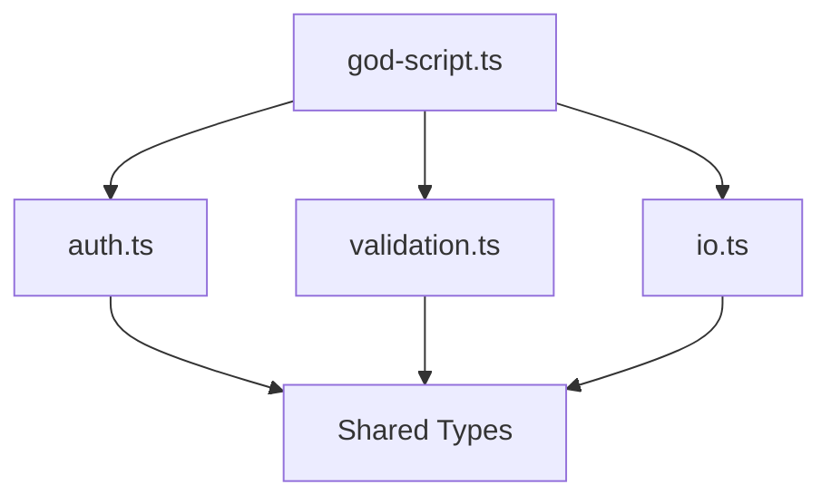
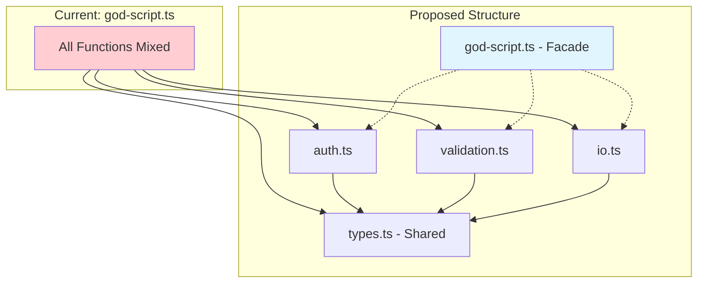

# Enhanced `/refactor` Command Implementation Plan

## Overview

A comprehensive refactoring command that safely decomposes monolithic "God-like" scripts into focused, testable modules. This plan synthesizes feedback from four expert reviews to create a production-ready implementation.

## Synthesis Summary

### Unanimous Agreement Across All Reviewers
- Phases are properly scoped (Analyze → Plan → Test → Extract → Verify)
- Tests-first (Phase 1) is the critical safety feature
- Parallel analysis with specialized agents is excellent
- Strict separation between read-only analysis and write-enabled execution

### Key Enhancements Incorporated

| Enhancement | Source | Impact |
|-------------|--------|--------|
| Language detection step | Opinions 1, 2 | Supports Python/Go, not just JS/TS |
| Explicit STOP & WAIT protocol | Opinions 1, 3 | Prevents agent auto-continuation |
| Facade/barrel strategy | Opinions 3, 4 | Safer than mass consumer updates |
| Directory mode with candidate selection | Opinion 4 | Prevents "mega refactor" accidents |
| Characterization testing fallback | Opinions 3, 4 | Handles untestable God objects |
| API snapshot baseline | Opinions 1, 4 | Enables before/after comparison |
| Mermaid diagram visualization | Opinion 1 | Mental model for decomposition |
| Restricted Bash patterns | Opinion 4 | Tighter security |
| Git abort option | Opinion 1 | Clean rollback on failure |
| Re-export tracing | Opinions 1, 3 | Catches the #1 refactoring bug |
| Path relativity check | Opinion 3 | Prevents broken relative paths |
| RPA-specific detection | Opinion 3 | Workflow calls, file I/O deps |

### Feedback NOT Incorporated (with reasoning)

| Suggestion | Reason Not Included |
|------------|---------------------|
| `permissionMode` field | Not yet standardized in Claude Code docs |
| Dry-run mode | Adds complexity; git branch approach is safer |
| Timeout parameters | Not configurable in current Task tool |
| Selector density flagging | Too RPA-specific; keep agents general |

---

## File Structure

```
commands/
├── refactor.md                    # Main command (enhanced)
└── refactor_candidates.md         # NEW: Discovery command for persistent index

agents/
├── god-module-finder.md           # NEW: Find refactoring candidates (scoring system)
├── api-snapshotter.md             # NEW: Capture API surface
├── responsibility-decomposer.md   # Enhanced with Mermaid, paths
├── coupling-analyzer.md           # Enhanced with global state
├── consumer-mapper.md             # Enhanced with re-export tracing
└── refactor-validator.md          # Enhanced with snapshot comparison
```

---

## Discovery Layer: Three Entry Points

To ensure God-like modules are always discoverable (not dependent on human intuition):

### Entry Point A: `/refactor <directory>` → Discover → Pick One
When a directory is passed, always run finder first, present shortlist, refactor ONE file per run.

### Entry Point B: `/tech_debt_sweep` → Emit God Modules Shortlist
Weekly sweep should contain "Top 10 God-like modules" with actionable links to `/refactor <path>`.

### Entry Point C: `/refactor_candidates` → Persistent Index
Dedicated command that writes `thoughts/shared/debt/YYYY-MM-DD-god-modules-index.md` for trends and CI automation.

---

## Command: `commands/refactor.md`

```markdown
---
description: Refactor monolithic/God-like code into focused, testable modules
argument-hint: "[file-path|directory] - Target to refactor or scan for candidates"
allowed-tools: Read, Glob, Grep, LS, Task, Edit, Write, TodoWrite, Bash(git status*), Bash(git diff*), Bash(git checkout*), Bash(git branch*), Bash(git reset*), Bash(npm test*), Bash(pnpm test*), Bash(yarn test*), Bash(go test*), Bash(pytest*), Bash(python -m pytest*), Bash(make test*), Bash(npm run lint*), Bash(npm run typecheck*), Bash(npx tsc*)
model: opus
---

# Refactor Code

You are tasked with refactoring monolithic "God-like" scripts/modules into clean, focused, testable units. This command operates in two modes depending on the target.

## Usage Modes

- `/refactor src/utils/helpers.ts` - **File Mode**: Refactor a specific file
- `/refactor src/services/` - **Directory Mode**: Find candidates, then refactor one
- `/refactor` - **Interactive Mode**: Scan for candidates automatically

The target path is available as `$ARGUMENTS`.

## Interaction Protocol

**CRITICAL**: When executing the refactoring plan:
1. Complete one phase (e.g., Add Tests)
2. Run verification
3. **STOP and present results**
4. **Do NOT proceed to the next phase until the user types "continue", "next", or "proceed"**
5. If verification fails, offer the abort option immediately

## Initial Response

### When invoked WITHOUT arguments (Interactive Mode):
```
I'll help you find and refactor God-like modules in your codebase.

Scanning for refactoring candidates...
```
Then spawn `god-module-finder` agent to scan the codebase and present top 5-10 candidates ranked by severity.

### When invoked WITH a directory path (Directory Mode):
```
Scanning [directory] for refactoring candidates...

I'll identify the worst offenders based on:
1. Lines of code (>300 LOC)
2. Export count (>15 exports)
3. Import fan-in (used by many files)
4. Responsibility mixing (multiple domains)
```
Then spawn `god-module-finder` agent scoped to that directory. Present candidates and ask user to pick ONE.

### When invoked WITH a file path (File Mode):
```
Starting refactor analysis for: [file]

First, detecting project type and conventions...
```
Then proceed to Step 1 immediately.

## Step 0: Language Detection (All Modes)

Before any analysis, detect the project environment:

1. **Check for project markers**:
   - `package.json` → Node.js/TypeScript (use `npm test`, `import` patterns)
   - `requirements.txt` / `pyproject.toml` / `setup.py` → Python (use `pytest`, `from/import` patterns)
   - `go.mod` → Go (use `go test`, `import` patterns)
   - `Cargo.toml` → Rust (use `cargo test`)
   - `Makefile` → Check for `make test` target

2. **Determine test command**:
   ```
   Project Type: [detected]
   Test Command: [npm test | pytest | go test ./... | etc.]
   Lint Command: [npm run lint | flake8 | golangci-lint | etc.]
   Import Pattern: [import/from | import | use]
   ```

3. **Store for later use** in verification steps

## Step 1: Read and Understand Current State (File Mode)

1. **Read the target file FULLY** - no limit/offset
2. **Read related files** - imports, tests, direct consumers
3. **Map current responsibilities** - what does this code do?
4. **Identify global state** - variables like `driver`, `config`, `logger`, `db`

## Step 2: Capture API Snapshot (Baseline)

**CRITICAL**: Before any analysis that might lead to changes, capture the baseline.

Spawn `api-snapshotter` agent:
```yaml
Task - API Baseline:
  subagent_type: api-snapshotter
  Prompt: |
    Capture complete API surface for [file].
    Include: all exports (functions, classes, types, constants)
    Include: type signatures if TypeScript
    Include: docstrings/comments for public API
    Return: structured snapshot for later comparison
    Limit response to 100 lines.
```

Store this snapshot mentally for Phase validation.

## Step 3: Spawn Analysis Agents (Parallel)

Use Task tool to spawn all analyzers in a single message (parallel execution):

```yaml
Task 1 - Responsibility Analysis:
  subagent_type: responsibility-decomposer
  Prompt: |
    Analyze [file] for distinct responsibilities.
    Project type: [detected type from Step 0]

    Identify: separate concerns, implicit domains, mixed abstractions.
    Check: relative file paths that would break if code moves.
    Generate: Mermaid diagram showing proposed module split.

    Return: proposed module breakdown with responsibility assignments.
    Include line ranges for each identified responsibility.
    STRICT LIMIT: 150 lines maximum.

Task 2 - Coupling Analysis:
  subagent_type: coupling-analyzer
  Prompt: |
    Analyze coupling patterns in [file] and its relationships.
    Project type: [detected type from Step 0]

    Find: tight coupling, circular dependencies, inappropriate intimacy.
    Detect: global state usage (driver, config, logger, db connections).
    Suggest: dependency injection points for extracted modules.

    Return: coupling metrics and decoupling opportunities.
    STRICT LIMIT: 100 lines maximum.

Task 3 - Consumer Impact:
  subagent_type: consumer-mapper
  Prompt: |
    Find all consumers of [file].
    Project type: [detected type from Step 0]

    Trace: re-exports recursively (index.ts → utils.ts → actual consumer).
    Include: CLI invocations (`python [file]`, `node [file]`).
    Include: file I/O dependencies (does another file read output of this one?).

    Map: which exports are used where, API surface analysis.
    Return: consumer list with specific usage patterns.
    STRICT LIMIT: 120 lines maximum.

Task 4 - Test Coverage Check:
  subagent_type: test-runner
  Prompt: |
    Find all tests for [file].
    Project type: [detected type from Step 0]

    Analyze: coverage gaps, missing edge cases, test quality.
    Assess: can we write unit tests, or do we need characterization tests?

    Return: test coverage assessment and testing strategy recommendation.
    STRICT LIMIT: 100 lines maximum.
```

**Wait for ALL agents to complete before proceeding.**

## Step 4: Synthesize Findings

After all agents complete:
- Consolidate into unified understanding
- Identify refactoring strategy
- Calculate risk assessment
- Determine if unit tests are feasible or if characterization tests are needed
- Note any global state that needs injection

## Step 5: Present Decomposition Options

Present findings with visualization:

```
Based on my analysis of [file]:

## Current State
- Lines of Code: X
- Exports: Y
- Consumers: Z files
- Test Coverage: W%

## Issues Identified
- [Responsibility 1] mixed with [Responsibility 2]
- Tight coupling to [module]
- Global state: [driver, config, etc.]
- Relative paths that would break: [list]

## Proposed Decomposition



### Option A: Extract by Domain
| New Module | Responsibility | Functions | Est. LOC |
|------------|----------------|-----------|----------|
| auth.ts | Authentication | login, logout, verify | ~80 |
| validation.ts | Input validation | validateEmail, validateUser | ~60 |

### Option B: Extract by Layer
| New Module | Responsibility | Functions | Est. LOC |
|------------|----------------|-----------|----------|
| service.ts | Business logic | processUser, handleAuth | ~100 |
| repository.ts | Data access | fetchUser, saveUser | ~40 |

## Risk Assessment
- **High**: [specific risk]
- **Medium**: [specific risk]
- **Low**: [specific risk]

## Testing Strategy
- [ ] Unit tests feasible: [Yes/No]
- [ ] Characterization tests needed: [Yes/No]
- [ ] Golden master approach: [If needed, describe]

Which approach would you prefer? (Or suggest modifications)
```

**STOP and wait for user selection.**

## Step 6: Write Refactoring Plan

After user chooses approach, write detailed plan to:
`thoughts/shared/plans/YYYY-MM-DD-refactor-[component-name].md`

### Plan Template

```markdown
# Refactor: [Component Name]

## Overview
[What we're refactoring and why]

## Current State
- File: [path]
- Lines: [count]
- Responsibilities: [list]
- Consumers: [count] files import this
- Global State: [driver, config, logger, etc.]

## API Snapshot (Must Preserve)
```
[Export list from api-snapshotter]
```

## Target State

```mermaid
[Diagram from responsibility-decomposer]
```

## Refactoring Strategy: Facade Pattern

**CRITICAL**: To minimize consumer churn:
1. Extract logic to new focused modules
2. Keep original file as a **facade** that re-exports everything
3. Verify all tests pass with facade in place
4. (Optional, later) Migrate consumers to import directly from new modules

## What We're NOT Doing
- Changing public API signatures
- Breaking existing import paths (facade preserves them)
- Adding new features
- Fixing unrelated bugs

---

## Phase 1: Establish Test Baseline

### Overview
Before any refactoring, establish behavior verification.

### Strategy Selection:
- [ ] **Unit Tests** - If testable in isolation
- [ ] **Characterization Tests** - If unit tests impossible
  - Run with known inputs
  - Capture outputs (logs, files, state)
  - Save as "Golden Master"
  - Compare after refactoring

### Changes Required:
- Create [test file] with comprehensive coverage
- Cover each exported function
- Document current behavior (even if buggy - preserve it)

### Success Criteria:

#### Automated Verification:
- [ ] All new tests pass: `[detected test command]`
- [ ] Coverage captured: `[coverage command if available]`

#### Manual Verification:
- [ ] Tests accurately reflect current behavior
- [ ] Edge cases identified and covered

**STOP HERE**: Present results and wait for "continue" before Phase 2.

---

## Phase 2: Extract [First Module]

### Overview
Extract [responsibility] into dedicated module using facade pattern.

### Changes Required:

#### 1. Create New Module
**File**: `[path/to/new-module.ext]`
```[language]
// Extract these functions from original:
// - function1 (lines X-Y)
// - function2 (lines A-B)

// Handle global state via dependency injection:
// export function function1(driver: Driver, config: Config) { ... }
```

#### 2. Update Original as Facade
**File**: `[original-file]`
```[language]
// Re-export to maintain API compatibility
export { function1, function2 } from './new-module';
```

#### 3. Fix Relative Paths (if any)
- Convert `./data/input.csv` to absolute using project root
- Or pass paths as parameters

### Success Criteria:

#### Automated Verification:
- [ ] All tests still pass: `[test command]`
- [ ] Type checking passes: `[typecheck command]`
- [ ] No new lint errors: `[lint command]`
- [ ] API snapshot unchanged (compare exports)

#### Manual Verification:
- [ ] Feature still works correctly in application
- [ ] No behavioral changes

**STOP HERE**: Present results and wait for "continue" before Phase 3.

---

## Phase 3: Extract [Second Module]
[Similar structure...]

---

## Rollback Strategy

If issues arise at any point:

### Immediate Abort
If verification fails and user chooses to stop:
```bash
git reset --hard HEAD
```
This returns to the clean state before any changes.

### Partial Rollback
If only the last phase failed:
```bash
git checkout HEAD~1 -- [affected files]
```

### Branch Strategy
All refactoring happens on a feature branch:
```bash
git checkout -b refactor/[component-name]
```
Main branch remains untouched until fully verified.

---

## Post-Refactor Validation

After all phases complete:

### Automated Checks
- [ ] All tests pass
- [ ] Type check clean
- [ ] Lint clean
- [ ] API snapshot matches baseline (no removed exports)

### Manual Checks
- [ ] Application works correctly
- [ ] Performance unchanged
- [ ] No regressions in dependent features

### Consumer Migration (Optional, Later)
After validation, consumers can be gradually updated:
- [ ] Update consumer 1 to import from new module
- [ ] Update consumer 2...
(This is optional - facade keeps everything working)
```

## Step 7: Execute Refactoring (if requested)

**Only proceed if user explicitly says "proceed", "implement", or "execute".**

### Pre-Execution Checklist

1. **Verify clean git state**:
   ```bash
   git status --porcelain
   ```
   If dirty, ask user to commit or stash first.

2. **Create feature branch**:
   ```bash
   git checkout -b refactor/[component-name]
   ```

3. **Confirm with user**:
   ```
   Ready to begin refactoring on branch `refactor/[component-name]`.

   Phase 1: [description]

   Proceed? (yes/no)
   ```

### Execution Loop

For each phase:

1. **Announce phase start**:
   ```
   Starting Phase N: [name]
   ```

2. **Make changes** using Edit tool

3. **Run automated verification**:
   ```bash
   [test command] && [lint command] && [typecheck command]
   ```

4. **Compare API snapshot**:
   - Run api-snapshotter again
   - Compare with baseline
   - Flag any removed or changed exports

5. **Present results**:
   ```
   Phase N Complete!

   Changes Made:
   - Created [file]
   - Modified [file]

   Verification:
   - Tests: PASS/FAIL
   - Lint: PASS/FAIL
   - Types: PASS/FAIL
   - API Preserved: YES/NO

   [If any FAIL or NO]:
   ⚠️ Issues detected. Options:
   1. Fix and retry
   2. Abort and rollback: `git reset --hard HEAD`

   [If all PASS]:
   Ready for next phase. Type "continue" to proceed.
   ```

6. **STOP AND WAIT** for user input

### Post-Completion

After all phases:
```
Refactoring Complete!

**Branch**: refactor/[component-name]

**Files Created:**
- [list]

**Files Modified:**
- [list]

**Verification Summary:**
- All tests pass: ✓
- Type check clean: ✓
- Lint clean: ✓
- API preserved: ✓

**Next Steps:**
1. Review changes: `git diff main`
2. Run manual verification
3. Commit: `/commit`
4. Create PR or merge to main
```

## Error Handling

### Test Failure
```
⚠️ Tests failed after Phase N changes.

Failed tests:
- [test name]: [error]

Options:
1. "fix" - Attempt to fix the issue
2. "abort" - Rollback all changes: `git reset --hard HEAD`
3. "skip" - Mark as known issue and continue (not recommended)
```

### Type Error
```
⚠️ Type errors introduced in Phase N.

Errors:
- [file:line]: [error]

This usually means an export signature changed. Checking API snapshot...
[Compare and report]
```

### Consumer Break
```
⚠️ Consumer file may be affected.

[consumer-file] imports [export] which was moved.

The facade should handle this, but verifying...
[Check import resolution]
```

## Success Criteria for Command

- [ ] Project type correctly detected
- [ ] All analysis agents completed within limits
- [ ] Decomposition options presented with Mermaid diagram
- [ ] User approved approach before execution
- [ ] (If executed) Facade pattern used to preserve API
- [ ] (If executed) Each phase verified before next
- [ ] (If executed) API snapshot matches baseline
- [ ] (If executed) All tests pass after refactoring
```

---

## Command: `commands/refactor_candidates.md` (NEW)

```markdown
---
description: Discover and index God-like modules for refactoring candidates
argument-hint: "[path] - Directory to scan (default: repo root)"
allowed-tools: Read, Glob, Grep, LS, Task, Write, Bash(wc -l*), Bash(git log*)
model: opus
---

# Refactor Candidates Discovery

You are tasked with discovering and indexing God-like modules/scripts that need refactoring. This command creates a persistent artifact for trends, sharing, and CI automation.

## Usage

- `/refactor_candidates` - Scan entire repo
- `/refactor_candidates src/` - Scan specific directory
- `/refactor_candidates --monorepo` - Group by package/workspace

The target path is available as `$ARGUMENTS`.

## Initial Response

```
Scanning for God-like modules...

I'll analyze all source files and rank them by:
1. Size (lines of code)
2. Public API surface (exports)
3. Coupling (fan-in/fan-out)
4. Code smells (TODO/FIXME, suppressions)
5. Churn hotspot (if git available)

Generating index artifact...
```

## Discovery Process

### Step 1: Detect Project Type and Structure

1. **Check for monorepo markers**:
   - `packages/`, `apps/`, `libs/` directories
   - `lerna.json`, `pnpm-workspace.yaml`, `nx.json`
   - Multiple `package.json`, `go.mod`, `Cargo.toml` files

2. **Identify all source directories**:
   - Group by package/workspace if monorepo
   - Note language per directory

### Step 2: Run God Module Finder

Spawn the `god-module-finder` agent with enhanced scoring:

```yaml
Task - Find God Modules:
  subagent_type: god-module-finder
  Prompt: |
    Scan [directory] for God-like modules.
    Use weighted scoring: size(30) + surface(20) + fan_in(20) + fan_out(10) + smell(10) + hotspot(10)

    Classify each candidate:
    - SEVERE (score >= 85)
    - HIGH (score >= 70)
    - MEDIUM (score >= 55)
    - LOW (score >= 40)

    For scripts (*.sh, if __name__=="__main__"), use script weights.
    Flag "big but cohesive" files as lower priority.

    Return: Ranked list with scores, reasons, recommended split strategy.
    STRICT LIMIT: 150 lines.
```

### Step 3: Enrich with Hotspot Data (Optional)

If git is available, add churn data:

```bash
# Get files with most commits in last 6 months
git log --since="6 months ago" --name-only --pretty=format: | sort | uniq -c | sort -rn | head -20
```

Cross-reference with God module candidates to identify "painful" files (big + hot).

### Step 4: Generate Index Artifact

Write to: `thoughts/shared/debt/YYYY-MM-DD-god-modules-index.md`

**CRITICAL**: Include YAML frontmatter for machine parsing and trends.

```markdown
---
date: [ISO timestamp]
type: god-modules-index
commit: [git rev-parse --short HEAD]
branch: [git branch --show-current]
scan_path: [directory scanned]
total_files_scanned: 234
total_candidates: 12
severe_count: 2
high_count: 4
medium_count: 6
metrics:
  average_god_score: 67.3
  worst_file: src/utils/helpers.ts
  worst_score: 94
---

# God Modules Index

**Generated**: YYYY-MM-DD HH:MM
**Commit**: [hash]
**Scan Path**: [path]

## Executive Summary

- **Files Scanned**: 234
- **Candidates Found**: 12
- **Severe (≥85)**: 2 - immediate attention needed
- **High (≥70)**: 4 - plan for this quarter
- **Medium (≥55)**: 6 - backlog items

## Candidates by Severity

### SEVERE (Score ≥ 85) 🔴

#### 1. `src/utils/helpers.ts` — Score: 94

| Metric | Value | Max | Contribution |
|--------|-------|-----|--------------|
| LOC | 850 | 30 | 25.5 |
| Exports | 40 | 20 | 20 |
| Fan-In | 60 | 20 | 20 |
| Fan-Out | 12 | 10 | 10 |
| Smells | 8 | 10 | 8.5 |
| Churn | 45 commits | 10 | 10 |

**Why it's God-like**:
- Kitchen sink naming (`helpers`, `utils`)
- Mixes: string manipulation, date formatting, auth helpers, API wrappers
- Imported by 60 files (coupling magnet)
- High churn (45 commits in 6 months)

**Classification**: Module (not script)
**Cohesion**: LOW — mixed domains
**Recommended Split**: Domain-first (auth, strings, dates, api)

**Next Action**: Run `/refactor src/utils/helpers.ts`

---

#### 2. `scripts/deploy.sh` — Score: 88

| Metric | Value | Max | Contribution |
|--------|-------|-----|--------------|
| LOC | 420 | 30 | 12.6 |
| Commands | 35 | 20 | 20 |
| Side Effects | 15 | 20 | 15 |
| Smells | 12 | 10 | 10 |
| Churn | 30 commits | 10 | 10 |

**Why it's God-like**:
- Does: build, test, docker, deploy, notify, cleanup
- 35 external commands
- Complex branching logic
- Hardcoded paths and credentials

**Classification**: Script (entrypoint)
**Cohesion**: LOW — pipeline stages mixed
**Recommended Split**: Pipeline modules + thin orchestrator

**Next Action**: Run `/refactor scripts/deploy.sh`

---

### HIGH (Score ≥ 70) 🟠

[Similar format for 4 candidates...]

### MEDIUM (Score ≥ 55) 🟡

[Condensed list with scores and one-line reasons...]

---

## Big But Cohesive (Not God-like)

These files are large but don't need refactoring:

| File | LOC | Why Cohesive |
|------|-----|--------------|
| src/types/schema.ts | 450 | Pure type definitions, no logic |
| src/constants/errors.ts | 320 | Error codes only, data file |
| generated/api-types.ts | 1200 | Auto-generated, don't touch |

---

## Monorepo Breakdown

(If applicable)

| Package | Candidates | Worst File | Score |
|---------|------------|------------|-------|
| @app/web | 3 | components/Form.tsx | 72 |
| @app/api | 2 | services/user.ts | 81 |
| @shared/utils | 1 | index.ts | 94 |

---

## Trend vs Previous Index

(If previous index exists)

| Metric | Previous | Current | Delta |
|--------|----------|---------|-------|
| Total Candidates | 10 | 12 | +2 ⚠️ |
| Severe | 1 | 2 | +1 ⚠️ |
| Average Score | 64.2 | 67.3 | +3.1 ⚠️ |

**New God Modules Since Last Scan**:
- `src/api/client.ts` (was 52, now 71) — grew from feature additions

**Resolved Since Last Scan**:
- `src/services/auth.ts` (was 78, refactored to 45) ✅

---

## Next Actions

1. **Immediate**: Refactor `src/utils/helpers.ts` — highest impact
2. **This Week**: Address `scripts/deploy.sh` — reliability risk
3. **This Sprint**: Plan refactoring for HIGH candidates
4. **Backlog**: Monitor MEDIUM candidates for growth
```

### Step 5: Optionally Write JSON Index

For machine parsing and CI integration:

Write to: `thoughts/shared/debt/YYYY-MM-DD-god-modules-index.json`

```json
{
  "date": "2025-12-25T10:30:00Z",
  "commit": "abc1234",
  "candidates": [
    {
      "path": "src/utils/helpers.ts",
      "score": 94,
      "severity": "SEVERE",
      "metrics": {
        "loc": 850,
        "exports": 40,
        "fan_in": 60,
        "fan_out": 12,
        "smells": 8,
        "churn": 45
      },
      "classification": "module",
      "cohesion": "LOW",
      "recommended_split": "domain-first",
      "domains_detected": ["auth", "strings", "dates", "api"]
    }
  ]
}
```

### Step 6: Present Summary

```
God Modules Index Generated!

**Artifact**: `thoughts/shared/debt/YYYY-MM-DD-god-modules-index.md`
**JSON**: `thoughts/shared/debt/YYYY-MM-DD-god-modules-index.json`

## Summary
- Files scanned: 234
- Candidates found: 12
- Severe: 2 (immediate action)
- High: 4 (plan this quarter)

## Top 3 Worst Offenders
1. `src/utils/helpers.ts` — Score 94 (SEVERE)
2. `scripts/deploy.sh` — Score 88 (SEVERE)
3. `src/services/user.ts` — Score 81 (HIGH)

## Quick Actions
- `/refactor src/utils/helpers.ts` — Refactor worst file
- `/tech_debt_sweep` — Full debt analysis including these
- View trends: `cat thoughts/shared/debt/*-god-modules-index.md`
```

## Success Criteria

- [ ] All source files scanned
- [ ] Candidates ranked with consistent scoring
- [ ] YAML frontmatter includes all metrics for trends
- [ ] Monorepo candidates grouped by package
- [ ] "Big but cohesive" false positives excluded
- [ ] Previous index compared if exists
- [ ] Actionable next steps provided
```

---

## Agent: `agents/god-module-finder.md` (NEW - Enhanced)

```markdown
---
name: god-module-finder
description: |
  Scans codebase for God modules using language-agnostic weighted scoring. Ranks candidates by severity (size + surface + coupling + smells + hotspot). Distinguishes modules from scripts. Flags false positives ("big but cohesive"). Essential for /refactor and /refactor_candidates.
tools: Grep, Glob, Read, LS
model: sonnet
---

You are a God module detector. Your job is to find monolithic files using tool-driven discovery (not LLM intuition) and rank them with a consistent, explainable scoring system.

## Exclusion Patterns (Consistent Across All Scans)

Always exclude:
- `node_modules/`, `.git/`, `dist/`, `build/`, `target/`
- `vendor/`, `.venv/`, `__pycache__/`, `coverage/`
- `bin/`, `obj/`, `*.min.js`, `*.bundle.js`
- `generated/`, `*.generated.*`, `*.g.dart`

## Weighted Scoring System (Language-Agnostic)

### Module Scoring (0-100)

| Metric | Max Points | Calculation |
|--------|------------|-------------|
| **Size** | 30 | min(30, LOC / 30) |
| **Public Surface** | 20 | min(20, exports * 1.0) |
| **Fan-In** | 20 | min(20, importers * 1.0) |
| **Fan-Out** | 10 | min(10, imports * 0.5) |
| **Smell Density** | 10 | (TODO + FIXME + suppressions) / LOC * 500 |
| **Hotspot** | 10 | min(10, commits_6mo * 0.25) |

**Severity Thresholds:**
- **SEVERE**: score ≥ 85 — Immediate action needed
- **HIGH**: score ≥ 70 — Plan for this quarter
- **MEDIUM**: score ≥ 55 — Backlog item
- **LOW**: score ≥ 40 — Monitor for growth

### Script Scoring (Different Weights)

For entrypoint scripts (`*.sh`, `if __name__=="__main__":`):

| Metric | Max Points | Calculation |
|--------|------------|-------------|
| **Size** | 25 | min(25, LOC / 20) |
| **External Commands** | 25 | min(25, cmd_count * 1.0) |
| **Side Effects** | 20 | (file writes + network + env changes) |
| **Smell Density** | 15 | (TODO + hardcoded paths + credentials) |
| **Hotspot** | 15 | min(15, commits_6mo * 0.3) |

## Language-Agnostic Detection Patterns

Use file extension + simple grep patterns (NOT AST parsing):

### Public Surface Detection

**TypeScript/JavaScript (`.ts`, `.tsx`, `.js`, `.jsx`):**
```
export (function|const|class|type|interface|enum)
export \{
export \* from
module\.exports
exports\.
```

**Python (`.py`):**
```
^def [a-z]           # public function
^class [A-Z]         # class
^[A-Z_]+ =           # module constant
__all__ =            # explicit exports
```

**Go (`.go`):**
```
^func [A-Z]          # exported function
^type [A-Z]          # exported type
^var [A-Z]           # exported var
^const [A-Z]         # exported const
```

**Rust (`.rs`):**
```
pub fn
pub struct
pub enum
pub trait
pub type
```

### God Smell Markers

Universal patterns that indicate God-ness:
- `TODO`, `FIXME`, `HACK`, `XXX` density
- Lint suppressions: `// eslint-disable`, `# noqa`, `//nolint`
- Section dividers: `// ===`, `# ---`, `/* *** */`
- Kitchen sink naming: `utils`, `helpers`, `common`, `shared`, `misc`
- Mixed concerns in same file (auth + db + validation patterns)

## Analysis Process

### Step 1: Glob for Source Files
```
**/*.ts, **/*.tsx, **/*.js, **/*.jsx
**/*.py
**/*.go
**/*.rs
**/*.sh
```

### Step 2: Quick Scan (Skip Small Files)
For each file:
- Count lines (skip if < 100 LOC)
- Detect language from extension
- Note if it's a script (entrypoint)

### Step 3: Deep Analysis (Candidates > 200 LOC)
For promising candidates:
- Count public surface (grep patterns)
- Count imports/dependencies
- Count smell markers
- Assess domain mixing

### Step 4: Calculate Fan-In
```
# How many files import this one?
grep -r "from './target'" --include="*.ts" | wc -l
grep -r "import target" --include="*.py" | wc -l
```

### Step 5: Classify and Score
- Apply module or script scoring weights
- Flag "big but cohesive" (high LOC, low smell, single domain)
- Recommend split strategy based on detected domains

## False Positive Handling

### "Big But Cohesive" Files
Flag as NOT God-like if:
- High LOC but low smell density (< 0.5%)
- Single domain detected (pure types, pure constants, pure data)
- Auto-generated files (`*.generated.*`, `generated/`)
- Test files (unless testing multiple components)

Example classifications:
```
src/types/schema.ts (450 LOC) → NOT God-like (pure types)
src/constants/errors.ts (320 LOC) → NOT God-like (data only)
generated/api-client.ts (1200 LOC) → NOT God-like (generated)
src/utils/helpers.ts (850 LOC) → God-like (mixed domains, high smell)
```

## Output Format

```
## God Module Candidates

### Summary
- Files scanned: X
- Candidates found: Y (scoring ≥ 40)
- Severe: Z (≥ 85)
- False positives excluded: W (big but cohesive)

### Top Candidates (Ranked by Score)

| Rank | File | Score | Classification | Cohesion | Split Strategy |
|------|------|-------|----------------|----------|----------------|
| 1 | src/utils/helpers.ts | 94 | Module | LOW | Domain-first |
| 2 | scripts/deploy.sh | 88 | Script | LOW | Pipeline stages |
| 3 | src/services/user.ts | 81 | Module | MEDIUM | Layer-first |

### Detailed Breakdown: Top 3

#### 1. src/utils/helpers.ts — Score: 94 (SEVERE)

| Metric | Value | Points |
|--------|-------|--------|
| LOC | 850 | 28.3 |
| Exports | 40 | 20 |
| Fan-In | 60 | 20 |
| Fan-Out | 12 | 6 |
| Smells | 8 markers | 9.4 |
| Churn | 45 commits | 10 |

**Why God-like:**
- Kitchen sink naming (`helpers`)
- Mixed domains: auth, strings, dates, API
- Coupling magnet (60 importers)
- High churn (frequently edited)

**Classification**: Module
**Cohesion**: LOW
**Recommended Split**: Domain-first
- `auth-helpers.ts` — login, logout, token functions
- `string-utils.ts` — formatters, parsers
- `date-utils.ts` — date formatting, timezone
- `api-utils.ts` — fetch wrappers, error handling

**Next Action**: `/refactor src/utils/helpers.ts`

---

### Big But Cohesive (Excluded)

| File | LOC | Why Excluded |
|------|-----|--------------|
| src/types/schema.ts | 450 | Pure type definitions |
| generated/client.ts | 1200 | Auto-generated |

### Monorepo Grouping (If Applicable)

| Package | Candidates | Worst | Score |
|---------|------------|-------|-------|
| @app/web | 3 | Form.tsx | 72 |
| @app/api | 2 | user.ts | 81 |
```

## Context Efficiency
- **Use tools first**: Glob/Grep/Read for concrete data
- **Return**: Ranked list with scores, classifications, recommendations
- **Omit**: Files below threshold, full file contents
- **STRICT LIMIT**: 150 lines maximum
- **Focus on**: Top 5-10 candidates with actionable next steps
```

---

## Agent: `agents/api-snapshotter.md` (NEW)

```markdown
---
name: api-snapshotter
description: |
  Captures the complete API surface of a module before refactoring. Creates a baseline that refactor-validator uses to ensure no exports were removed or signatures changed. Critical for safe refactoring.
tools: Grep, Glob, Read, LS
model: sonnet
---

You are an API surface documenter. Your job is to capture every public export from a module so we can verify the API is preserved after refactoring.

## What to Capture

### Exports (ALL of these)
1. **Functions**: Name, parameters, return type
2. **Classes**: Name, public methods, constructor signature
3. **Types/Interfaces**: Name, key properties
4. **Constants**: Name, type, value (if simple)
5. **Re-exports**: What's re-exported from other modules

### For Each Export
- Name
- Kind (function, class, type, const)
- Signature (parameters + return type)
- Line number (for reference)
- JSDoc/docstring summary (if present)

## Language-Specific Patterns

### TypeScript/JavaScript
```typescript
// Capture:
export function login(user: string, pass: string): Promise<Token>
export class AuthService { ... }
export type User = { ... }
export const API_URL = "..."
export { helper } from './utils'  // re-export
export * from './types'  // barrel re-export
```

### Python
```python
# Capture:
def login(user: str, password: str) -> Token: ...
class AuthService: ...
# Check __all__ for explicit exports
__all__ = ['login', 'AuthService']
```

### Go
```go
// Capture all capitalized (exported) names:
func Login(user string, pass string) (*Token, error)
type AuthService struct { ... }
const APIURL = "..."
```

## Output Format

```
## API Snapshot: [file]

**Captured at**: [timestamp]
**File**: [path]
**Total Exports**: X

### Functions (Y total)
| Name | Signature | Line |
|------|-----------|------|
| login | (user: string, pass: string) => Promise<Token> | 45 |
| logout | () => void | 89 |

### Classes (Z total)
| Name | Constructor | Public Methods | Line |
|------|-------------|----------------|------|
| AuthService | (config: Config) | login, logout, verify | 120 |

### Types (W total)
| Name | Kind | Key Properties | Line |
|------|------|----------------|------|
| User | interface | id, name, email | 10 |
| Token | type | value, expires | 15 |

### Constants (V total)
| Name | Type | Value | Line |
|------|------|-------|------|
| API_URL | string | "https://..." | 5 |
| TIMEOUT | number | 5000 | 6 |

### Re-exports (U total)
| Export | Source |
|--------|--------|
| * | ./types |
| helper | ./utils |

---

## Compatibility Checklist
After refactoring, verify:
- [ ] All X functions still exported with same signatures
- [ ] All Y classes still exported with same public API
- [ ] All Z types still exported
- [ ] All W constants still exported
- [ ] All U re-exports still work (or replaced with facade)
```

## Context Efficiency
- **Return**: Complete export manifest
- **Omit**: Implementation details
- **Max response**: ~100 lines
- **Focus on**: Public API surface only
```

---

## Agent: `agents/responsibility-decomposer.md` (ENHANCED)

```markdown
---
name: responsibility-decomposer
description: |
  Analyzes monolithic code for distinct responsibilities and proposes module decomposition. Identifies implicit domains, mixed abstractions, and separation opportunities. Outputs Mermaid diagrams for visualization.
tools: Grep, Glob, Read, LS
model: sonnet
---

You are a code architect specializing in identifying responsibilities within monolithic modules.

## Exclusion Patterns
Always exclude: `node_modules/`, `.git/`, `dist/`, `build/`, `vendor/`, `.venv/`

## Core Responsibilities

1. **Single Responsibility Identification**
   - Find distinct concerns mixed in one file
   - Identify code that "does too many things"
   - Detect multiple abstraction levels mixed together

2. **Domain Boundary Detection**
   - Find implicit domains (auth, validation, persistence, etc.)
   - Identify code that belongs together semantically
   - Detect feature clusters

3. **Path Relativity Check**
   - Scan for relative file paths (`./`, `../`)
   - Flag paths that would break if code moves to subdirectory
   - Recommend: convert to absolute paths using project root

4. **Global State Detection**
   - Find module-level variables (driver, config, logger, db)
   - Note which functions depend on global state
   - Recommend: dependency injection for extracted modules

5. **Mermaid Diagram Generation**
   - Create visual representation of proposed decomposition
   - Show dependencies between new modules

## Analysis Method

1. **Read the target file completely**
2. **Catalog all exports** - what does this module expose?
3. **Map internal functions** - group by what they do
4. **Identify data flows** - what data moves where?
5. **Detect responsibility clusters**
6. **Check for path relativity issues**
7. **Generate Mermaid diagram**

## Output Format

```
## Responsibility Analysis: [file]

### Summary
- Total exports: X
- Identified responsibilities: Y
- Recommended modules: Z
- Path relativity issues: N
- Global state dependencies: M

### Current Responsibilities

#### Responsibility 1: [Name] (Lines X-Y)
Functions: func1(), func2(), func3()
Description: Handles [what]
Cohesion: HIGH/MEDIUM/LOW
Extraction difficulty: EASY/MEDIUM/HARD
Global state used: [config, logger, etc.]

#### Responsibility 2: [Name] (Lines X-Y)
[Similar...]

### Path Relativity Issues
⚠️ These relative paths will break if code moves:
| Path | Used In | Recommendation |
|------|---------|----------------|
| ./data/input.csv | processFile():45 | Use PROJECT_ROOT + '/data/input.csv' |
| ../config.json | loadConfig():12 | Inject config as parameter |

### Global State Analysis
| Variable | Type | Used By | Injection Strategy |
|----------|------|---------|-------------------|
| config | Config | func1, func3 | Pass as first parameter |
| logger | Logger | func2, func4 | Pass as parameter or use context |
| driver | WebDriver | func5 | Required dependency injection |

### Proposed Decomposition

| New Module | Responsibility | Functions to Move | Line Count |
|------------|----------------|-------------------|------------|
| user-auth.ts | Authentication | login, logout, verify | ~80 |
| user-profile.ts | Profile Management | getProfile, updateProfile | ~60 |

### Visualization



### Extraction Order (safest first)
1. [Module] - No dependencies on other extractions
2. [Module] - Depends on #1
3. [Module] - Final extraction
```

## Context Efficiency
- **Return**: Responsibility map, path issues, Mermaid diagram, extraction order
- **Omit**: Line-by-line code walkthrough
- **STRICT LIMIT**: 150 lines maximum
```

---

## Agent: `agents/coupling-analyzer.md` (ENHANCED)

```markdown
---
name: coupling-analyzer
description: |
  Measures coupling between modules and identifies decoupling opportunities. Finds tight coupling, circular dependencies, inappropriate intimacy, and global state dependencies.
tools: Grep, Glob, Read, LS
model: sonnet
---

You are a coupling analysis specialist. Your job is to measure dependencies and identify decoupling opportunities for safe refactoring.

## Exclusion Patterns
Always exclude: `node_modules/`, `.git/`, `dist/`, `build/`, `vendor/`, `.venv/`

## Core Responsibilities

1. **Import Analysis**
   - Map all imports into the target file
   - Map all imports of the target file (consumers)
   - Calculate afferent/efferent coupling

2. **Circular Dependency Detection**
   - Find import cycles between modules
   - Identify tightly coupled file clusters

3. **Global State Analysis**
   - Find shared mutable state (singletons, module globals)
   - Identify hidden dependencies through global access
   - Recommend dependency injection points

4. **Decoupling Opportunities**
   - Suggest interface extraction
   - Identify dependency injection opportunities
   - Find inversion points

## Coupling Metrics

- **Afferent Coupling (Ca)**: Files that depend on this module
- **Efferent Coupling (Ce)**: Files this module depends on
- **Instability (I)**: Ce / (Ca + Ce) - higher = more unstable
- **Coupling Score**: Subjective 1-10 based on analysis

## Output Format

```
## Coupling Analysis: [file]

### Metrics Summary
- Afferent Coupling (Ca): X files import this
- Efferent Coupling (Ce): This imports Y files
- Instability Index: 0.XX (0=stable, 1=unstable)
- Coupling Score: X/10 (X = concerning)

### Dependency Graph

Imports INTO target:
- src/utils/helpers.ts (3 functions)
- src/types/user.ts (5 types)
- external: lodash (2 functions)

Imports FROM target (consumers):
- src/pages/Login.tsx (imports: login, logout)
- src/api/client.ts (imports: authToken, refreshToken)
- [+12 more files]

### Circular Dependencies
⚠️ Cycle detected:
target.ts → auth/utils.ts → target.ts

### Global State Dependencies

| Global | Type | Scope | Coupling Risk |
|--------|------|-------|---------------|
| config | Config | module | MEDIUM - passed around implicitly |
| dbConnection | Pool | module | HIGH - hidden dependency |
| logger | Logger | module | LOW - stateless utility |

**Injection Points Needed:**
```typescript
// Before (tight coupling)
function login() {
  const result = db.query(...);  // Hidden global dependency
}

// After (injectable)
function login(db: Database) {
  const result = db.query(...);  // Explicit dependency
}
```

### Coupling Issues

| Issue | Severity | Location | Suggestion |
|-------|----------|----------|------------|
| Direct internal access | HIGH | consumer.ts:45 | Export interface instead |
| Shared mutable state | HIGH | target.ts:23 | Extract to context/store |
| Hidden db dependency | MEDIUM | target.ts:67 | Inject as parameter |

### Decoupling Recommendations

1. **Extract Interface** for auth functions
   - Create IAuthService interface
   - Consumers import interface, not implementation

2. **Dependency Injection** for database
   - Pass db connection as parameter
   - Enables testing and flexibility
   - Breaks hidden coupling

3. **Break Cycle** with auth/utils.ts
   - Extract shared types to common/types.ts
```

## Context Efficiency
- **Return**: Metrics, global state analysis, decoupling recommendations
- **Omit**: Every single import line
- **STRICT LIMIT**: 100 lines maximum
```

---

## Agent: `agents/consumer-mapper.md` (ENHANCED)

```markdown
---
name: consumer-mapper
description: |
  Maps all consumers of a module including re-export chains, CLI invocations, and file I/O dependencies. Critical for understanding refactoring impact and maintaining API compatibility.
tools: Grep, Glob, Read, LS
model: sonnet
---

You are a consumer impact analyst. Your job is to find every file that uses a target module and understand exactly how they use it, including indirect dependencies.

## Exclusion Patterns
Always exclude: `node_modules/`, `.git/`, `dist/`, `build/`, `vendor/`, `.venv/`

## Core Responsibilities

1. **Direct Consumer Discovery**
   - Find all files that import the target
   - Include dynamic imports and require statements
   - Handle different import syntaxes per language

2. **Re-Export Chain Tracing** (CRITICAL)
   - If index.ts re-exports target.ts, trace to ULTIMATE consumers
   - Build complete chain: target.ts → index.ts → consumer.ts
   - This prevents the #1 refactoring bug

3. **Non-Import Dependencies**
   - CLI invocations: `python target.py`, `node target.js`
   - Shell scripts that call the target
   - File I/O: Does another script read files this one writes?

4. **Usage Pattern Analysis**
   - Which exports are actually used?
   - Are there unused exports (dead code)?
   - How is each export used (call, extend, type)?

## Analysis Method

1. **Grep for direct imports**:
   - `from 'target'` / `from './target'`
   - `require('target')` / `require('./target')`
   - `import target` (Python)
   - `import "target"` (Go)

2. **Find re-export files** (index.ts, __init__.py, etc.)

3. **Trace re-exports recursively**:
   ```
   target.ts
     ↓ re-exported by
   src/index.ts
     ↓ re-exported by
   src/utils/index.ts
     ↓ imported by
   consumer.ts  ← This is the ULTIMATE consumer
   ```

4. **Search for CLI/script usage**:
   - Grep for filename in shell scripts
   - Check package.json scripts
   - Check Makefile targets

5. **Catalog exports and their consumers**

## Output Format

```
## Consumer Map: [target-file]

### Summary
- Direct consumers: X files
- Via re-exports: Y files
- CLI invocations: Z scripts
- File I/O dependencies: W files
- Unique exports used: A of B
- Unused exports: [list]

### Re-Export Chains
⚠️ These chains must be updated together:

Chain 1:
```
target.ts
  └─> src/index.ts (export * from './target')
        └─> app/utils/index.ts (export { login } from 'src')
              └─> app/pages/Login.tsx (import { login })
              └─> app/pages/Admin.tsx (import { login })
```

Chain 2:
```
target.ts
  └─> lib/index.ts (export { validate })
        └─> tests/helpers.ts (import { validate })
```

### Export Usage Matrix

| Export | Type | Direct | Via Re-export | CLI | Pattern |
|--------|------|--------|---------------|-----|---------|
| login() | function | 3 | 5 | 0 | Direct call |
| UserType | type | 2 | 8 | 0 | Type annotation |
| processFile | function | 0 | 0 | 2 | CLI: `node target.js process` |
| validateEmail | function | 0 | 0 | 0 | ⚠️ UNUSED |

### Non-Import Dependencies

#### CLI Invocations
| Script | Command | Purpose |
|--------|---------|---------|
| scripts/build.sh | `node target.js build` | Build step |
| Makefile | `python target.py --validate` | Validation |

#### File I/O Dependencies
| File | Reads | Writes | Dependency |
|------|-------|--------|------------|
| target.ts | - | output.json | - |
| consumer.ts | output.json | - | Depends on target output |

### Consumer Details

#### High-Impact (>3 exports used)
1. **src/pages/Login.tsx** [via: src/index.ts → target.ts]
   - Uses: login, logout, isAuthenticated, UserType
   - Impact if changed: HIGH

2. **src/api/client.ts** [direct import]
   - Uses: authToken, refreshToken, AuthConfig
   - Impact if changed: HIGH

#### Low-Impact (1-2 exports)
- tests/helpers.ts → validate (testing only)
- types/index.ts → UserType (re-export only)

### Safe to Remove (unused exports)
- validateEmail() - no consumers found
- OLD_AUTH_KEY - no consumers found

### Migration Checklist
If target.ts is refactored with facade pattern:
- [ ] Facade re-exports maintain all X exports
- [ ] Re-export chain files updated: [list]
- [ ] CLI scripts still work
- [ ] File I/O dependencies unaffected
```

## Context Efficiency
- **Return**: Complete dependency graph including re-exports and CLI
- **Omit**: Full file contents
- **STRICT LIMIT**: 120 lines maximum
```

---

## Agent: `agents/refactor-validator.md` (ENHANCED)

```markdown
---
name: refactor-validator
description: |
  Validates refactoring results by comparing API snapshots, checking behavior preservation, and verifying consumer compatibility. Runs after each refactoring phase.
tools: Grep, Glob, Read, LS, Bash
model: sonnet
---

You are a refactoring validator. Your job is to verify that refactoring preserved behavior, maintained API compatibility, and didn't break consumers.

## Validation Process

### Phase 1: Run Automated Checks
```bash
# Detect and run appropriate commands
npm test || yarn test || pnpm test || pytest || go test ./... || make test
npm run typecheck || npx tsc --noEmit || mypy . || true
npm run lint || eslint . || flake8 || golangci-lint run || true
```

### Phase 2: API Snapshot Comparison

Compare current exports against baseline snapshot:

1. **Read original snapshot** (provided in context)
2. **Scan current exports** from refactored files
3. **Diff check**:
   - Missing exports? → FAIL
   - Changed signatures? → WARN (may be intentional)
   - New exports? → OK (additions are safe)

### Phase 3: Consumer Compatibility Check

1. **Verify import resolution** still works
2. **Check facade is re-exporting** correctly
3. **Scan for broken references**

### Phase 4: Behavioral Verification

1. **If tests pass**: Behavior preserved ✓
2. **If characterization tests exist**: Compare golden master
3. **If tests fail**: Report specific failures

## Output Format

```
## Refactor Validation Report

### Summary
| Check | Status | Details |
|-------|--------|---------|
| Tests | ✅ PASS | 45/45 passed |
| Types | ✅ PASS | 0 errors |
| Lint | ⚠️ WARN | 2 new warnings (non-blocking) |
| API | ✅ PASS | All exports preserved |
| Consumers | ✅ PASS | All imports resolve |

**Overall Status**: ✅ READY TO CONTINUE

### API Compatibility Check

#### Baseline vs Current
| Export | Baseline | Current | Status |
|--------|----------|---------|--------|
| login | ✓ | ✓ | ✅ |
| logout | ✓ | ✓ | ✅ |
| UserType | ✓ | ✓ | ✅ |
| validateEmail | ✓ | (removed) | ⚠️ UNUSED, OK |

#### Signature Changes
None detected. ✅

#### Facade Check
Original file re-exports all moved functions: ✅

### Consumer Compatibility

| Consumer | Status | Notes |
|----------|--------|-------|
| Login.tsx | ✅ | Import resolves via facade |
| Admin.tsx | ✅ | Import resolves via facade |
| helpers.ts | ✅ | Direct import updated |

### Test Results

```
Tests: 45 passed, 0 failed
Coverage: 78% (unchanged from baseline)
```

### Issues Found

#### Blocking Issues
(None)

#### Warnings (Non-Blocking)
1. **New lint warning** in auth.ts:23
   - Rule: prefer-const
   - Impact: None, stylistic only

### Recommendation
**PROCEED** to next phase.

---

[If issues found:]

### Blocking Issues
1. **Missing export**: `validateUser` was exported in baseline but not in current
   - Location: Was in god-script.ts:145
   - Fix: Add to facade re-exports

2. **Test failure**: `test_login_with_invalid_user`
   - Error: Expected 401, got 500
   - Likely cause: Error handling changed during extraction

### Recommendation
**FIX ISSUES** before continuing.

Options:
1. Fix the issues and re-validate
2. Abort and rollback: `git reset --hard HEAD`
```

## Context Efficiency
- **Return**: Pass/fail matrix with specific issues
- **STRICT LIMIT**: 80 lines maximum
```

---

---

## Integration: `/tech_debt_sweep` Enhancement

To complete the discovery layer, `/tech_debt_sweep` should emit a God modules shortlist in its output.

### Recommended Addition to tech_debt_sweep.md

Add this section to the sweep output template:

```markdown
## God Modules Shortlist

### Top 10 Refactoring Candidates

| Rank | File | Score | Severity | Action |
|------|------|-------|----------|--------|
| 1 | src/utils/helpers.ts | 94 | SEVERE | `/refactor src/utils/helpers.ts` |
| 2 | scripts/deploy.sh | 88 | SEVERE | `/refactor scripts/deploy.sh` |
| 3 | src/services/user.ts | 81 | HIGH | `/refactor src/services/user.ts` |
| ... | ... | ... | ... | ... |

### Newly God-like Since Last Sweep
- `src/api/client.ts` (was 52, now 71) — grew from feature additions

### God-like + Hotspot (High Churn)
These are the most painful files (big + frequently edited):
- `src/utils/helpers.ts` — 45 commits, 94 score
- `scripts/deploy.sh` — 30 commits, 88 score

**Next Action**: Run `/refactor_candidates` for full index or `/refactor <file>` for immediate action.
```

### Integration Steps

1. **Add to Step 4** of tech_debt_sweep: Spawn `god-module-finder` alongside other scanners
2. **Add to debt report template**: Include God modules shortlist section
3. **Add to paydown plan**: Include refactoring recommendations with `/refactor` links

---

## Enhancement History

### 2025-12-25 Enhancement (Round 2)
Based on 5th expert review (Staff SWE, tech debt systems), this plan was improved with:

**From Opinion 5 — Discovery Layer:**
- Added `/refactor_candidates` command for persistent index artifact
- Enhanced `god-module-finder` with weighted scoring system (size/surface/coupling/smell/hotspot)
- Added "Three Entry Points" architecture for reliable discovery
- Added module vs script scoring (different weights for entrypoints)
- Added "big but cohesive" false positive handling
- Added monorepo grouping support
- Added YAML frontmatter metrics for trend stability
- Added JSON index output for CI automation
- Added `/tech_debt_sweep` integration notes
- Made exclusion patterns consistent across all agents
- Added churn/hotspot detection via git log

**Key Principle**: Discovery must be tool-driven (Glob/Grep/LS), not LLM intuition

### 2025-12-25 Enhancement (Round 1)
Based on synthesis of 4 expert reviews, this plan was improved with:

**From Opinion 1:**
- Added Mermaid diagram generation to responsibility-decomposer
- Added git abort option (`git reset --hard HEAD`) on verification failure
- Strict line limit enforcement for all agents

**From Opinion 2:**
- Added explicit phase flow diagram
- Integration recommendation with existing debt agents
- Timeout awareness (documented as limitation)

**From Opinion 3:**
- Added explicit STOP & WAIT protocol to prevent auto-continuation
- Added re-export chain tracing to consumer-mapper
- Added facade/barrel pattern as default refactoring strategy
- Added path relativity check to responsibility-decomposer
- Added characterization testing fallback for untestable code
- Added global state/context injection guidance

**From Opinion 4:**
- Restricted Bash to specific safe patterns in allowed-tools
- Added god-module-finder agent for directory mode
- Added api-snapshotter agent for baseline capture
- Split command into File Mode vs Directory Mode
- Added facade/barrel as explicit default strategy
- Fixed markdown fence recommendations

**Feedback NOT incorporated:**
- `permissionMode` field (not yet in stable Claude Code docs)
- Selector density flagging (too RPA-specific)
- Dry-run mode (git branch approach is safer)
- Timeout parameters (not configurable in Task tool)
