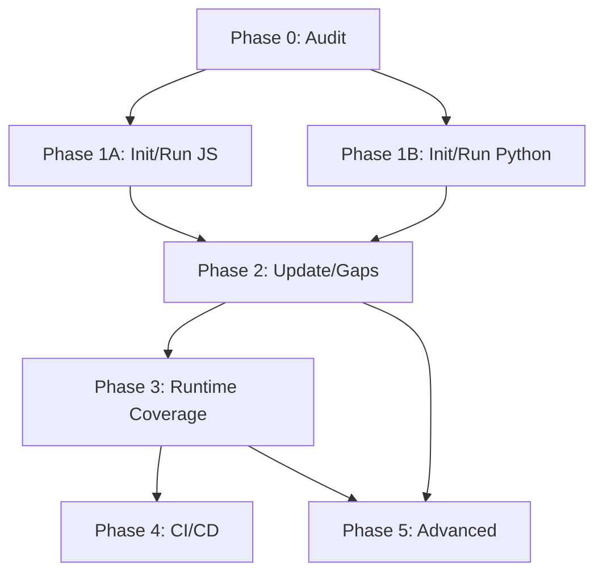

# `/test_suite` Command Implementation Plan

> **Status (2026-06-12)**: Phases 0.5 and 2.5 are implemented — `adopt` and `standardize [apply]` subcommands ship in `commands/test_suite.md` (with `init` defaulting to adopt when tests exist), and `agents/test-refactorer.md` exists. Success-criteria checkboxes below remain unchecked because they require an end-to-end run against a real fragmented repo, which is still open (see roadmap `2026-06-10-plugin-improvement-roadmap.md`, item 3.8).

## Overview

A comprehensive test suite management command that creates, maintains, and tracks tests with coverage trending. This plan synthesizes feedback from three expert reviews to create a production-ready, language-agnostic implementation.

## Synthesis Summary

### Unanimous Agreement Across Reviewers
- Move `audit` earlier (it's foundational, not advanced)
- Plan/apply mode for safety (matches `/refactor` philosophy)
- Convention-detecting test layouts (don't force single structure)
- Non-destructive updates (never auto-rewrite assertions)
- Test Harness Manifest for determinism

### Key Enhancements Incorporated

| Enhancement | Source | Impact |
|-------------|--------|--------|
| Audit as Phase 0 | Opinion 1 | Foundation before scaffolding |
| Split gaps: static vs runtime | Opinion 1 | Works without coverage tools |
| Mock-architect agent | Opinion 2 | Handles mocking complexity |
| Type-resolver step | Opinion 2 | Understands type signatures |
| Snapshot sanitization | Opinion 2 | Prevents flaky tests |
| Human-in-loop validation | Opinion 3 | Reduces hallucinations |
| Test Harness Manifest | Opinion 1 | Repeatable configuration |
| Risk-based prioritization | Opinion 1 | Better than coverage % |
| Security guardrails | Opinion 3 | Prevent credential exposure |
| Idempotency rules | Opinion 1 | Safe repeated runs |
| **Multi-suite manifest** | Opinions 4, 5 | Supports unit/integration/e2e layers |
| **E2E detection + run** | Opinions 4, 5 | Detect and execute E2E without generating |
| **Adopt subcommand** | Opinion 4 | Harmonize execution for legacy repos |
| **Standardize subcommand** | Opinion 5 | Migrate to majority test pattern |
| **`managed: false` for E2E** | Opinion 5 | Don't auto-generate E2E tests |

### Feedback NOT Incorporated

| Suggestion | Reason |
|------------|--------|
| AST parsing per language | Too complex; regex patterns sufficient |
| Full coverage enforcement | Optional, not all repos have tools |
| Auto-commit generated tests | Too risky; require explicit apply |
| **E2E test generation** | Too complex; requires app-specific knowledge (URLs, auth flows, environment) |
| **AI Evals in this command** | Functionally different; defer to separate `/eval_suite` command |
| **Mutation testing** | Expensive; toolchain-heavy; later scope |

---

## Current State Analysis

### Existing Infrastructure

| Component | Status | Location |
|-----------|--------|----------|
| test-runner agent | Exists | `agents/test-runner.md` |
| Hooks for test running | Exists | `hooks/hooks.json` |
| Coverage tracking | Missing | - |
| Test generation | Missing | - |
| CI/CD templates | Missing | - |

### Key Discoveries

1. **test-runner.md** already handles multi-framework detection (Jest, pytest, go test, cargo test, etc.)
2. **hooks.json** runs related tests on Stop event via `npm test -- --findRelatedTests`
3. No existing coverage artifacts in `thoughts/shared/`
4. `/refactor` command already integrates with test-runner for Phase verification

---

## Desired End State

After implementation:

1. `/test_suite audit` produces a Test Harness Manifest with detected conventions
2. `/test_suite init` scaffolds tests following repo conventions (or language defaults)
3. `/test_suite update` syncs tests with changed code (non-destructively)
4. `/test_suite gaps` identifies untested code (static + runtime modes)
5. `/test_suite run` executes tests with structured reporting
6. `/test_suite ci` generates GitHub/GitLab workflow configurations
7. Coverage trends tracked in `thoughts/shared/test-coverage/`

### Verification

```bash
# Audit produces manifest
/test_suite audit
cat thoughts/shared/test-suite/test-suite-manifest.json

# Gaps identifies untested code
/test_suite gaps --priority=high

# CI config generated
/test_suite ci --github
cat .github/workflows/test.yml
```

---

## What We're NOT Doing

- Auto-committing generated tests (require explicit `apply`)
- Full AST parsing (use regex patterns)
- Forcing specific test directory layouts
- Auto-rewriting assertions (plan mode by default)
- Supporting every test framework initially (JS/TS first)
- **Deep E2E Scaffolding**: We detect and run E2E if configured, but won't install Playwright/Cypress browsers or manage seed databases
- **E2E Test Generation**: E2E requires app-specific knowledge (URLs, auth flows, environment); generation is future scope
- **AI Evaluations**: "Evals" (non-deterministic output checking) belongs in a separate `/eval_suite` command
- **Mutation Testing**: Expensive and toolchain-heavy; may add later as opt-in
- **Test Quality Metrics**: Assertion density, mock overuse, brittle patterns - explicit later scope

---

## Implementation Approach

**Controller-Worker Pattern** (consistent with RPA):
- Command acts as orchestrator (user interaction, synthesis)
- Agents do specialized work (analysis, generation, validation)

**Safety-First** (matches `/refactor` philosophy):
- All subcommands produce plans by default
- `apply` flag required to make changes
- Human approval for assertion changes

**Language-Agnostic Foundation**:
- Framework detection via manifest files
- Convention-detecting layouts
- Static gap analysis works without coverage tools

---

## File Structure

```
commands/
└── test_suite.md                    # Main command

agents/
├── test-runner.md                   # Already exists - enhance
├── test-analyzer.md                 # NEW: Harness detection, coverage parsing
├── test-generator.md                # NEW: Creates tests with strategies
├── test-architect.md                # NEW: Mock strategy, dependency analysis
├── test-updater.md                  # NEW: Syncs tests with code changes
├── test-impact-mapper.md            # NEW: Changed files → impacted tests
└── coverage-reporter.md             # NEW: Parses coverage, generates reports

thoughts/shared/
├── test-suite/
│   ├── test-suite-manifest.json     # Detected conventions (from audit)
│   └── YYYY-MM-DD-test-plan.md      # Action plans (from init/update/gaps)
└── test-coverage/
    ├── YYYY-MM-DD-coverage.md       # Coverage snapshots
    └── YYYY-MM-DD-coverage.json     # Machine-readable
```

---

## Phase 0: Audit & Harness Detection (2-3 days)

### Overview
Build the foundation: detect existing test infrastructure, produce repeatable manifest.

### Changes Required

#### 1. Create `agents/test-analyzer.md`
**Purpose**: Detect test framework, conventions, coverage backend

```yaml
---
name: test-analyzer
description: |
  Analyzes test infrastructure: framework detection, convention discovery,
  coverage backend identification. Produces Test Harness Manifest for
  deterministic subsequent runs.
tools: Glob, Grep, Read, LS
model: sonnet
---
```

**Core Responsibilities**:
1. Detect test framework from manifest files
2. Find existing test patterns (directory, naming)
3. Identify coverage backend (if available)
4. Detect monorepo structure
5. Produce structured manifest

**Output**: Test Harness Manifest (JSON + MD)

#### 2. Create `agents/coverage-reporter.md`
**Purpose**: Parse coverage data, generate reports with trends

```yaml
---
name: coverage-reporter
description: |
  Parses coverage output from various backends (Istanbul, pytest-cov,
  go cover, tarpaulin). Generates trend reports and identifies gaps.
tools: Glob, Grep, Read, LS
model: sonnet
---
```

#### 3. Create `commands/test_suite.md` (audit subcommand)
**Initial implementation** with audit functionality only.

### Artifacts Produced

**Test Harness Manifest** (`thoughts/shared/test-suite/test-suite-manifest.json`):
```json
{
  "detected_at": "2025-12-28T10:30:00Z",
  "commit": "abc1234",
  "languages": ["typescript"],
  "frameworks": {
    "lint": "eslint",
    "typecheck": "tsc"
  },
  "layers": {
    "unit": {
      "command": "npm run test:unit",
      "command_single": "npx jest {file} -t \"{name}\"",
      "coverage_command": "npm run test:unit -- --coverage",
      "backend": "jest",
      "managed": true,
      "patterns": ["**/*.test.ts", "**/*.spec.ts"],
      "directories": ["__tests__", "src/**/__tests__"]
    },
    "integration": {
      "command": "npm run test:int",
      "coverage_command": "npm run test:int -- --coverage",
      "backend": "jest",
      "managed": true,
      "patterns": ["**/*.integration.ts"],
      "directories": ["tests/integration"]
    },
    "e2e": {
      "command": "npm run test:e2e",
      "backend": "playwright",
      "managed": false,
      "patterns": ["e2e/**/*.spec.ts"],
      "directories": ["e2e"],
      "schedule": "nightly"
    }
  },
  "commands": {
    "all": "npm test",
    "lint": "npm run lint"
  },
  "coverage_backend": {
    "available": true,
    "tool": "istanbul",
    "output_path": "coverage/coverage-summary.json"
  },
  "monorepo": {
    "detected": false,
    "packages": []
  }
}
```

**Key Schema Concepts**:
- `layers`: Separate configurations for unit/integration/e2e suites
- `managed: true/false`: Whether we generate tests for this layer (false for E2E)
- `schedule`: Optional; hints for CI (e.g., "nightly" for E2E)
- `commands.all`: Unified command to run everything

### Success Criteria

#### Automated Verification:
- [ ] Manifest written to `thoughts/shared/test-suite/test-suite-manifest.json`
- [ ] All detected frameworks are accurate (verified against package.json/etc.)
- [ ] Patterns match actual test file locations
- [ ] E2E layer detected if Playwright/Cypress/Selenium present

#### Manual Verification:
- [ ] Run `cat thoughts/shared/test-suite/test-suite-manifest.json | jq .`
- [ ] Verify test command works: run the detected command
- [ ] Check edge cases: empty repo, no tests, multiple frameworks

---

## Phase 0.5: Adopt Existing Suites (Added to Phase 0)

> ✅ **Implemented 2026-06-11**: `/test_suite adopt [apply]` subcommand in `commands/test_suite.md`; `init` defaults to adopt when tests exist. Verification boxes below pending e2e run (roadmap item 3.8).

### Overview
For legacy repos with existing tests, provide an adoption path that harmonizes execution and reporting without forcing file migrations.

### New Subcommand: `/test_suite adopt`

**Purpose**: When tests already exist, produce a "harmonization plan" instead of erroring.

**Detection Logic**:
```
1. Run audit to detect all test layers
2. If tests exist:
   → Default to adopt plan (not error)
   → Propose wrapper scripts for unified execution
   → Generate CI jobs for each detected layer
3. If no tests:
   → Proceed to init
```

**Adopt Flow**:
```
1. Inventory existing suites (unit/integration/e2e)
2. Detect runners per language/package
3. Propose minimal glue:
   - Wrapper scripts (safe, reversible)
   - package.json scripts (marked blocks only)
   - Makefile targets
4. Generate unified reporting format
5. If --apply: write glue files
```

### Agent Addition: Update `test-analyzer.md`

Add responsibilities:
- Detect mixed frameworks (jest + vitest, pytest + unittest)
- Identify "majority pattern" (e.g., 80% jest, 20% mocha)
- Recommend unification strategy
- Flag conflicting configurations

### Wrapper Script Example

**Generated**: `scripts/test-all.sh`
```bash
#!/bin/bash
set -e

echo "=== Running Unit Tests ==="
npm run test:unit || exit 1

echo "=== Running Integration Tests ==="
npm run test:int || exit 1

# E2E only if --e2e flag passed
if [[ "$1" == "--e2e" ]]; then
  echo "=== Running E2E Tests ==="
  npm run test:e2e || exit 1
fi

echo "=== All Tests Passed ==="
```

### Success Criteria

#### Automated Verification:
- [ ] `adopt` produces harmonization plan
- [ ] Wrapper scripts execute all detected layers
- [ ] Mixed frameworks handled (run both, report separately)

#### Manual Verification:
- [ ] Legacy repo with existing tests works
- [ ] No forced file migrations

---

## Phase 1A: Core Init/Run - TypeScript/Jest (1 week)

### Overview
Implement init and run for Node.js/TypeScript projects with Jest. Perfect one ecosystem before expanding.

### Changes Required

#### 1. Create `agents/test-architect.md`
**Purpose**: Analyze dependencies, determine mock strategy

```yaml
---
name: test-architect
description: |
  Analyzes dependencies to determine what to mock vs import.
  Classifies code as pure/impure, identifies side effects,
  generates mock scaffolding strategy.
tools: Grep, Glob, Read, LS
model: sonnet
---
```

**Core Responsibilities**:
1. Scan imports for side-effect dependencies (DB, API, FS)
2. Classify functions: pure, impure, async
3. Determine mock strategy per dependency
4. Generate `jest.mock()` scaffolding

**Classification Rules**:
- Pure: No external deps → unit test directly
- Impure: Network/DB/FS → generate mocks
- Async: Special handling with await patterns

#### 2. Create `agents/test-generator.md`
**Purpose**: Generate tests using multiple strategies

```yaml
---
name: test-generator
description: |
  Generates tests using multiple strategies: signature-based,
  implementation-based, characterization. Includes snapshot
  sanitization and type resolution.
tools: Grep, Glob, Read, LS
model: sonnet
---
```

**Strategies**:
1. **Signature-based**: Generate from function types
2. **Implementation-based**: Read code, find edge cases
3. **Characterization**: Capture current behavior (opt-in)

**Sanitization Rules**:
- Replace ISO dates with `'DATE_PLACEHOLDER'`
- Replace UUIDs with `'UUID_PLACEHOLDER'`
- Mask API keys/tokens

#### 3. Update `commands/test_suite.md`
Add `init` and `run` subcommands.

**Init Flow**:
```
1. Read manifest (or run audit first)
2. Spawn test-architect for each source file
3. Spawn test-generator with architect's mock strategy
4. Write plan to thoughts/shared/test-suite/YYYY-MM-DD-test-plan.md
5. If --apply: write test files
```

**Run Flow**:
```
1. Execute test command from manifest
2. Parse results
3. Report failures with file:line references
4. Suggest fixes
```

### Convention Detection Rules

| Language | If Exists | Else Default |
|----------|-----------|--------------|
| TS/JS | Match existing: `__tests__/`, `*.test.ts`, etc. | `src/{path}.test.ts` |
| Python | Match existing: `tests/`, `test_*.py` | `tests/test_{module}.py` |
| Go | Always: `{file}_test.go` | (idiomatic, no choice) |
| Rust | Match: `#[cfg(test)]` or `tests/` | `#[cfg(test)]` inline |

### Success Criteria

#### Automated Verification:
- [ ] `test_suite init` produces plan file
- [ ] `test_suite init apply` creates test files
- [ ] Generated tests compile: `npx tsc --noEmit`
- [ ] Generated tests pass: `npm test`
- [ ] Mocks are correctly generated for external deps

#### Manual Verification:
- [ ] Review generated test quality
- [ ] Verify mock strategy is appropriate
- [ ] Check edge case handling

---

## Phase 1B: Core Init/Run - Python/Pytest (1 week)

### Overview
Extend init/run to Python projects with pytest.

### Changes Required

#### 1. Update `agents/test-architect.md`
Add Python-specific patterns:
- `unittest.mock` patterns
- `@pytest.fixture` generation
- `conftest.py` handling

#### 2. Update `agents/test-generator.md`
Add Python-specific templates:
- pytest assertions
- parametrized tests
- async test patterns (pytest-asyncio)

### Python-Specific Rules

**Mock Detection**:
```python
# Side-effect imports to mock
import requests  # → mock
import sqlite3   # → mock
from pathlib import Path  # → mock if writing

# Safe imports
from typing import ...  # → don't mock
from dataclasses import ...  # → don't mock
```

**Fixture Pattern**:
```python
# conftest.py
@pytest.fixture
def mock_db():
    with patch('module.db') as mock:
        yield mock
```

### Success Criteria

#### Automated Verification:
- [ ] Python tests generated with correct pytest patterns
- [ ] conftest.py created when fixtures needed
- [ ] Tests pass: `pytest -v`

#### Manual Verification:
- [ ] Review fixture usage
- [ ] Verify mock patterns are pythonic

---

## Phase 2: Update & Static Gaps (1 week)

### Overview
Implement test syncing and gap detection that works without coverage tools.

### Changes Required

#### 1. Create `agents/test-updater.md`
**Purpose**: Sync tests with code changes non-destructively

```yaml
---
name: test-updater
description: |
  Updates tests to match code changes. Non-destructive by default:
  renames, moves, signature changes are auto-fixed; assertion
  changes require approval.
tools: Grep, Glob, Read, LS
model: sonnet
---
```

**Safe Auto-Updates**:
- File renames/moves → update import paths
- Function renames → update test names
- Signature changes (params) → update test calls
- Deleted functions → mark tests for removal

**Requires Approval**:
- Assertion value changes
- Snapshot updates
- Logic changes in test

#### 2. Create `agents/test-impact-mapper.md`
**Purpose**: Map code changes to test impacts

```yaml
---
name: test-impact-mapper
description: |
  Maps changed files to impacted tests and identifies missing tests.
  Works without coverage tools using import/usage heuristics.
tools: Grep, Glob, Read, LS
model: sonnet
---
```

**Static Gap Detection** (no coverage required):
- Public functions with no test references
- High fan-in modules with few test mentions
- Changed files with no nearby tests
- Exported symbols never imported in test files

#### 3. Update `commands/test_suite.md`
Add `update` and `gaps` subcommands.

**Gaps Tiers**:
- **Tier A (Static)**: Always available, uses heuristics
- **Tier B (Runtime)**: Uses coverage tools when available

### Priority Scoring for Gaps

```
Priority Score =
  (fan_in × 0.3) +           # How many files use this
  (churn × 0.2) +             # Recent changes
  (complexity × 0.2) +        # Cyclomatic complexity proxy
  (security_hint × 0.2) +     # auth/crypto/validate in name
  (zero_test × 0.1)           # No tests at all
```

### Success Criteria

#### Automated Verification:
- [ ] `update` produces non-destructive plan
- [ ] Safe changes apply without breaking tests
- [ ] `gaps` works without coverage tools (static mode)
- [ ] `gaps --runtime` uses coverage when available

#### Manual Verification:
- [ ] Verify update doesn't silently change assertions
- [ ] Priority ranking matches intuition

---

## Phase 2.5: Standardize Test Suites (Optional)

> ✅ **Implemented 2026-06-11**: `/test_suite standardize [apply]` subcommand in `commands/test_suite.md`; `agents/test-refactorer.md` created. Verification boxes below pending e2e run (roadmap item 3.8).

### Overview
For repos with fragmented test suites (mixed frameworks, scattered files), provide an active migration path to unify them.

### New Subcommand: `/test_suite standardize`

**Purpose**: Refactor the test suite itself to match the "Best Pattern" found during audit.

**Standardize Flow**:
```
1. Run audit to find "Majority Vote"
   → e.g., 80% of tests use Jest in __tests__, 20% use Mocha in spec/
2. Propose migration plan:
   "I found a split personality in your test suite.
    I recommend migrating the 20% Mocha tests to Jest."
3. If --apply:
   → Rewrite assertions: expect(x).to.equal(y) → expect(x).toBe(y)
   → Move files to majority directory
   → Run tests to verify migration
4. Report results
```

### New Agent: `agents/test-refactorer.md`

**Purpose**: Migrate tests between frameworks

```yaml
---
name: test-refactorer
description: |
  Migrates tests between frameworks (Mocha→Jest, unittest→pytest).
  Rewrites assertions, moves files, verifies tests still pass.
  Extension of test-updater with framework-aware transformations.
tools: Grep, Glob, Read, LS
model: sonnet
---
```

**Capabilities**:
1. **Framework Migration**: Rewrite `unittest` classes to `pytest` functions
2. **Assertion Translation**: `expect(x).to.equal(y)` → `expect(x).toBe(y)`
3. **Structure Unification**: Move scattered files to majority convention
4. **Dead Test Removal**: Delete test files that no longer import valid source
5. **Verify After Migration**: Run tests to confirm no regressions

### Migration Rules

| From | To | Assertion Transform |
|------|-----|---------------------|
| Mocha/Chai | Jest | `expect(x).to.equal(y)` → `expect(x).toBe(y)` |
| unittest | pytest | `self.assertEqual(x, y)` → `assert x == y` |
| assert (Node) | Jest | `assert.equal(x, y)` → `expect(x).toBe(y)` |

### Success Criteria

#### Automated Verification:
- [ ] Standardize produces migration plan
- [ ] Assertion rewrites are syntactically valid
- [ ] All tests pass after migration: `npm test` / `pytest`
- [ ] No duplicate tests created

#### Manual Verification:
- [ ] Review migrated test quality
- [ ] Verify edge cases handled correctly

---

## Phase 3: Runtime Coverage & Thresholds (3-5 days)

### Overview
Add runtime coverage parsing and threshold enforcement.

### Changes Required

#### 1. Update `agents/coverage-reporter.md`
Add parsers for:
- Istanbul/nyc (JSON summary)
- pytest-cov (XML/JSON)
- go test -coverprofile
- cargo tarpaulin (when available)

#### 2. Coverage Artifacts

**Weekly Report** (`thoughts/shared/test-coverage/YYYY-MM-DD-coverage.md`):
```markdown
---
date: 2025-12-28T10:30:00Z
type: test-coverage
commit: abc1234
metrics:
  overall: 67.3
  unit: 78.5
  functions_covered: 234
  functions_total: 312
threshold: 80
status: below_threshold
---

# Test Coverage Report
...
```

**JSON for Trends** (`thoughts/shared/test-coverage/YYYY-MM-DD-coverage.json`)

### Success Criteria

#### Automated Verification:
- [ ] Coverage report generated from tool output
- [ ] Threshold check works: pass/fail status
- [ ] JSON artifact parseable by trends command

#### Manual Verification:
- [ ] Coverage numbers accurate
- [ ] Trend visualization readable

---

## Phase 4: CI/CD Generation (3 days)

### Overview
Generate GitHub Actions and GitLab CI configurations.

### Changes Required

#### 1. Create `agents/ci-generator.md`
**Purpose**: Generate CI/CD workflow files

```yaml
---
name: ci-generator
description: |
  Generates CI/CD configurations for GitHub Actions and GitLab CI.
  Includes test execution, coverage thresholds, and PR comments.
tools: Glob, Grep, Read, LS
model: sonnet
---
```

#### 2. Update `commands/test_suite.md`
Add `ci` subcommand with options:
- `--github` - GitHub Actions
- `--gitlab` - GitLab CI
- `--threshold=80` - Coverage threshold

### Generated Files

**CI generator reads the manifest** and generates jobs only for detected languages/suites.

**GitHub Actions** (`.github/workflows/test.yml`):
```yaml
name: Test Suite
on: [push, pull_request]

jobs:
  unit:
    runs-on: ubuntu-latest
    steps:
      - uses: actions/checkout@v4
      - uses: actions/setup-node@v4
        with:
          node-version: '20'
          cache: 'npm'
      - run: npm ci
      - run: npm run test:unit -- --coverage
      - name: Check threshold
        run: |
          COVERAGE=$(jq '.total.lines.pct' coverage/coverage-summary.json)
          if [ $(echo "$COVERAGE < 80" | bc -l) -eq 1 ]; then
            echo "Coverage $COVERAGE% below 80%"
            exit 1
          fi

  integration:
    runs-on: ubuntu-latest
    needs: unit
    steps:
      - uses: actions/checkout@v4
      - uses: actions/setup-node@v4
      - run: npm ci
      - run: npm run test:int

  e2e:
    runs-on: ubuntu-latest
    needs: [unit, integration]
    # E2E only on schedule or manual trigger (from manifest.layers.e2e.schedule)
    if: github.event_name == 'schedule' || github.event_name == 'workflow_dispatch'
    steps:
      - uses: actions/checkout@v4
      - uses: actions/setup-node@v4
      - run: npm ci
      - run: npx playwright install --with-deps
      - run: npm run test:e2e
```

**Key CI Features**:
- **Multi-job structure**: Separate jobs for unit/integration/e2e
- **E2E on schedule**: Runs nightly or on-demand (not every PR)
- **Coverage thresholds**: Per-layer if configured
- **Manifest-driven**: Only generates jobs for detected layers

### Success Criteria

#### Automated Verification:
- [ ] GitHub workflow syntax valid: `actionlint`
- [ ] GitLab CI syntax valid

#### Manual Verification:
- [ ] Workflow runs successfully in CI
- [ ] Coverage threshold enforced

---

## Phase 5: Advanced Features (1 week)

### Overview
Characterization tests, flakiness detection, trends.

### Changes Required

#### 1. Characterization Mode
- `--characterization` flag for init/gaps
- Capture current behavior as snapshots
- Add warning: "This may lock in bugs"

#### 2. Flakiness Detection
Add to test-analyzer:
- Recently failing tests (git log)
- Time-based sleeps in test code
- Non-deterministic patterns (random, Date.now)

#### 3. Trends Command
Add `trends` subcommand:
- Read historical coverage JSONs
- Generate trend report
- ASCII chart for terminal

### Success Criteria

#### Automated Verification:
- [ ] Characterization generates snapshot tests
- [ ] Flaky tests flagged in audit output
- [ ] Trends command produces readable output

#### Manual Verification:
- [ ] Characterization captures actual behavior
- [ ] Trends show meaningful patterns

---

## Testing Strategy

### Unit Tests
- Test manifest parsing
- Test coverage report parsing
- Test priority scoring

### Integration Tests
- End-to-end: audit → init → run
- CI generation → workflow execution

### Manual Testing
1. Run on a real JS/TS project
2. Run on a real Python project
3. Verify generated tests are meaningful
4. Check CI workflow execution

---

## Security Considerations

### Fixture/Snapshot Sanitization
- Redact API keys: `API_KEY` → `'REDACTED'`
- Mask tokens: anything matching `Bearer .*` → `'BEARER_TOKEN'`
- Synthetic data only: no production URLs

### Permissions
- Generated tests should not have secrets
- Integrate with config-auditor patterns

---

## Idempotency Rules

| Subcommand | Behavior |
|------------|----------|
| `audit` | Overwrites manifest (it's a snapshot) |
| `init` | **If tests exist → default to `adopt` plan** (not error) |
| `init --force` | Overwrite existing tests (dangerous) |
| `adopt` | Produces harmonization plan; safe to run repeatedly |
| `update` | Incremental, non-destructive |
| `gaps` | Additive (won't duplicate) |
| `standardize` | Produces migration plan; apply requires confirmation |
| `ci` | Update within marked blocks only |
| `run` | Execute only, no state changes |
| `run --suite=X` | Execute specific layer (unit/integration/e2e) |

---

## Command Preview

```markdown
---
description: Create, update, and maintain test suites with coverage tracking
argument-hint: "[audit|init|adopt|update|gaps|run|ci|standardize] [options]"
allowed-tools: Read, Glob, Grep, LS, Task, Edit, Write, TodoWrite, Bash(npm test:*), Bash(npm run test:*), Bash(npx jest:*), Bash(npx playwright:*), Bash(pytest:*), Bash(python -m pytest:*), Bash(go test:*), Bash(cargo test:*), Bash(make test:*), Bash(git diff:*), Bash(git log:*)
model: opus
---

# Test Suite Management

You manage test suites: creation, maintenance, coverage tracking, and CI integration.

## Usage Modes

- `/test_suite audit` - Detect test infrastructure, produce manifest
- `/test_suite adopt [apply]` - Harmonize existing suites (for legacy repos)
- `/test_suite init [apply]` - Scaffold tests (plan by default; if tests exist → adopt)
- `/test_suite update [apply]` - Sync tests with code changes
- `/test_suite gaps [--runtime] [apply]` - Find and fill coverage holes
- `/test_suite run [--suite=unit|integration|e2e] [--coverage]` - Execute and report
- `/test_suite ci [--github|--gitlab]` - Generate multi-suite CI configuration
- `/test_suite standardize [apply]` - Migrate fragmented suites to majority pattern
- `/test_suite trends` - View coverage trends over time

## Suite Layers

Tests are organized into layers:
- **unit**: Fast, isolated tests (managed: generated by this command)
- **integration**: Module interaction tests (managed: generated)
- **e2e**: Full flow tests (unmanaged: run only, don't generate)

## Safety Philosophy

All subcommands produce **plans** by default. Add `apply` to make changes.
Assertion changes always require human approval.
E2E tests are run but never auto-generated (use `managed: false`).
```

---

## Dependencies Between Phases



---

## Rollback Strategy

If issues arise:
- Generated test files: `git checkout -- tests/`
- Manifest: `rm thoughts/shared/test-suite/test-suite-manifest.json`
- CI configs: `git checkout -- .github/workflows/`

---

## References

- Expert Opinion 1: Staff SWE, Test Automation
- Expert Opinion 2: Mocking/JS Focus
- Expert Opinion 3: Validation/Human-in-Loop
- Existing: `agents/test-runner.md`
- Existing: `hooks/hooks.json`
- Pattern: `commands/tech_debt_sweep.md`
- Pattern: `commands/refactor.md`
